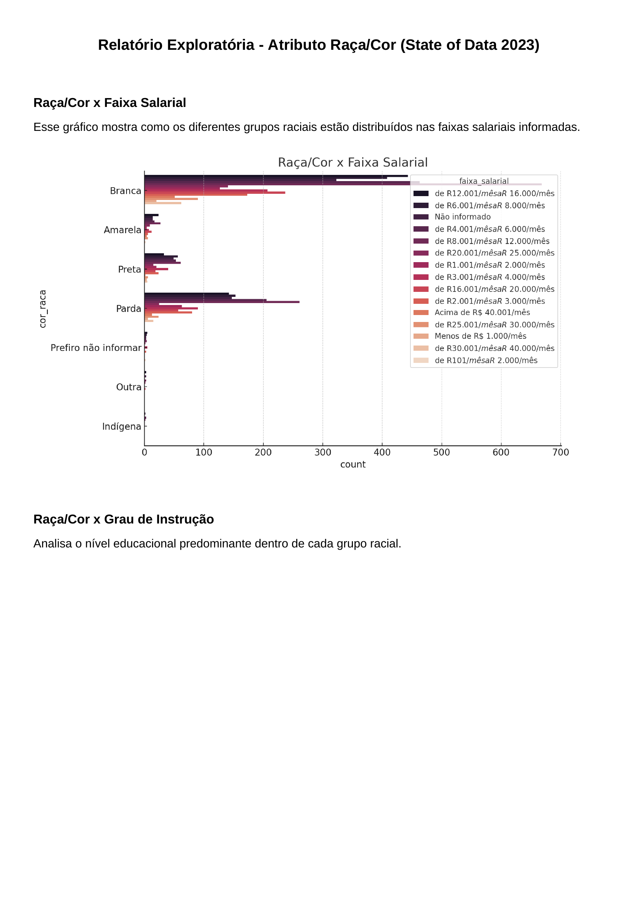
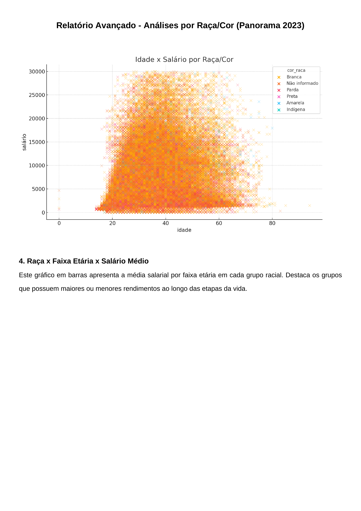
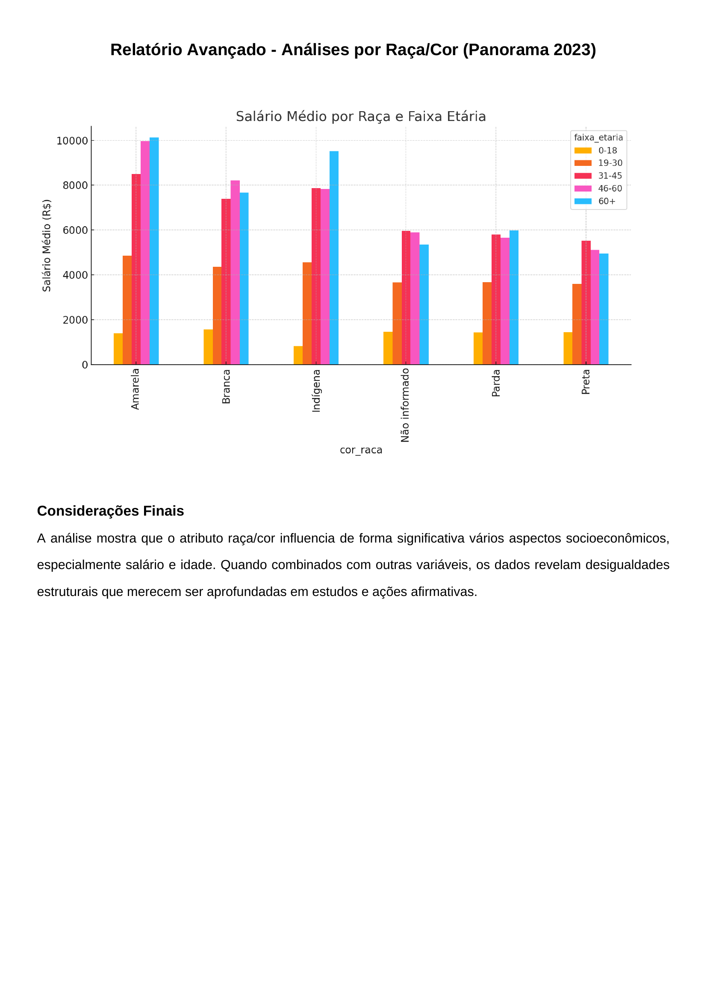

# Educação, Empregabilidade e Raça: O Que Os Dados Revelam.


**Álvaro Felix da Silva, alvaro.silva@sga.pucminas.br**

**Ana Cecília Souza Lorens, acslorens@sga.pucminas.br**

**Beatriz Azevedo dos Santos, beatriz.santos.1595043@sga.pucminas.br**

**Mariana Andrade Silva, mariana.andrade.1566766@sga.pucminas.br**

**Sarah Mariana Guedes de Almeida  sarah.almeida.1582677@sga.pucminas.br**

---

Professores:

**Prof. Hugo Bastos de Paula**

**Prof. Hayala Nepomuceno Curto.**

---

_Curso de Ciência de Dados, Unidade Praça da Liberdade_

_Instituto de Informática e Ciências Exatas – Pontifícia Universidade de Minas Gerais (PUC MINAS), Belo Horizonte – MG – Brasil_

---
## Índice

- [Resumo](#resumo)
- [Introdução](#introdução)
  - [Contextualização](#contextualização)
  - [Problema](#problema)
  - [Objetivo geral](#objetivo-geral)
    - [Objetivos específicos](#objetivos-específicos)
  - [Justificativas](#justificativas)
- [Público alvo](#público-alvo)
- [Análise exploratória dos dados](#análise-exploratória-dos-dados)
  - [Dicionário de dados](#dicionário-de-dados)
  - [Descrição de dados](#descrição-de-dados)
    - [Relatório Exploratória - Empregabilidade e Faixa Salarial (CAGED)](#relatório-exploratória---empregabilidade-e-faixa-salarial-caged)
    - [Relatório Exploratória - Empregabilidade e Faixa Salarial (STATE OF DATA 2023)](#relatório-exploratória---empregabilidade-e-faixa-salarial-state-of-data-2023)
- [Preparação dos dados](#preparação-dos-dados)
  - [Definição do Tema e Seleção Inicial de Variáveis](#definição-do-tema-e-seleção-inicial-de-variáveis)
  - [Desafios de Integração com o INEP](#desafios-de-integração-com-o-inep)
  - [Escolha da Base CAGED-2023 como Fonte Complementar](#escolha-da-base-caged-2023-como-fonte-complementar)
  - [Definição de Chave Estrangeira e Estratégia de Fusão](#definição-de-chave-estrangeira-e-estratégia-de-fusão)
  - [Visualização e Descrição Exploratória dos Dados](#visualização-e-descrição-exploratória-dos-dados)
  - [Contraste entre Fontes e Contribuição Analítica](#contraste-entre-fontes-e-contribuição-analítica)
  - [Limpeza e Tratamento das Bases](#limpeza-e-tratamento-das-bases)
  - [Combinação das Bases](#combinação-das-bases)
  - [Criação da Variável Alvo](#criação-da-variável-alvo)
  - [Modelagem](#modelagem)
  - [Indução de modelos](#indução-de-modelos)
- [Modelo 1: Random Forest](#modelo-1-random-forest)
  - [Etapas do Processo](#etapas-do-processo)
- [Modelo 2: Algoritmo](#modelo-2-algoritmo)
  - [Resultados obtidos com o modelo 2](#resultados-obtidos-com-o-modelo-2)
  - [Resultados obtidos com o modelo 2 (pós otimização)](#resultados-obtidos-com-o-modelo-2-pós-otimização)
  - [Interpretação do modelo 2](#interpretação-do-modelo-2)
  - [Interpretação do modelo 2 (pós otimização)](#interpretação-do-modelo-2-pós-otimização)
    - [Tendências identificadas pelo modelo](#tendências-identificadas-pelo-modelo)
- [Análise comparativa dos modelos](#análise-comparativa-dos-modelos)
- [Relatório Desafios do Projeto](#relatório-desafios-do-projeto)
  - [1. Evolução do Pipeline de Modelagem](#1-evolução-do-pipeline-de-modelagem)
    - [1.1 Primeira abordagem — Árvore de Decisão](#11-primeira-abordagem—árvore-de-decisão)
    - [1.2 Segunda abordagem — Random Forest como alternativa de otimização do modelo anterior, aplicando RandomizedSearchCV](#12-segunda-abordagem—random-forest-como-alternativa-de-otimização-do-modelo-anterior-aplicando-randomizedsearchcv)
    - [1.3 Terceira abordagem — SVM com SMOTE e ajuste fino de threshold](#13-terceira-abordagem—svm-com-smote-e-ajuste-fino-de-threshold)
  - [2. Desafios Técnicos Enfrentados (Resumo)](#2-desafios-técnicos-enfrentados-resumo)
    - [2.1 Qualidade da base](#21-qualidade-da-base)
    - [2.2 Inconsistência em variáveis categóricas](#22-inconsistência-em-variáveis-categóricas)
    - [2.3 Desbalanceamento severo da variável alvo](#23-desbalanceamento-severo-da-variável-alvo)
    - [2.4 Aplicação incorreta de SMOTE na primeira versão](#24-aplicação-incorreta-de-smote-na-primeira-versão)
    - [2.5 Limitação das variáveis disponíveis](#25-limitação-das-variáveis-disponíveis)
  - [3. Tentativas de Otimização Não Bem-Sucedidas (Registro)](#3-tentativas-de-otimização-não-bem-sucedidas-registro)
  - [4. Considerações Finais](#4-considerações-finais)
- [8. Conclusão Final do Trabalho](#8-conclusão-final-do-trabalho)
- [REFERÊNCIAS](#referências)
- [APÊNDICES](#apêndices)
  - [Bases de Dados](#bases-de-dados)
  - [Códigos](#códigos)
  - [Artefatos](#artefatos)
    - [Modelo 1 – Random Forest](#modelo-1–random-forest)
    - [Modelo 2 – SVM](#modelo-2–svm)

---

## Resumo

Este projeto teve como objetivo analisar desigualdades raciais no mercado de trabalho tecnológico brasileiro, investigando os fatores que influenciam a inserção formal de pessoas pretas, pardas, indígenas e amarelas, a partir da análise integrada dos dados do CAGED e da pesquisa State of Data Brasil 2023. Foram considerados atributos como escolaridade, idade e raça/cor para construir modelos classificatórios capazes de identificar padrões e disparidades. A base utilizada apresentou considerável desbalanceamento, o que limitou a obtenção de resultados conclusivos para responder à questão proposta. Apesar disso, os modelos aplicados demonstraram bom desempenho, indicando que ajustes na qualidade e balanceamento dos dados podem possibilitar análises mais precisas e confiáveis. Esses insights destacam a relevância de políticas públicas inclusivas e a necessidade de aprimoramento dos conjuntos de dados para análises mais rigorosas da equidade racial no setor tecnológico.


---


## Introdução

É nítido que o mercado de trabalho tecnológico brasileiro tem se destacado e evoluído de forma exponencial nos últimos anos. Diversas empresas têm adotado métodos e políticas de contratação inclusivas, mas, apesar disso, ainda existem muitos desafios enfrentados por pessoas não brancas em processos seletivos e no avanço de suas carreiras profissionais.

Nesse projeto, utilizamos dados que permitem entender quais fatores influenciam a contratação de profissionais negros, pardos e indígenas, e se existe uma diferença nos critérios de exigência, quando comparados aos candidatos brancos.

O estudo é importante para compreender padrões de contratação dentro do mercado de trabalho tecnológico, e identificar possíveis desigualdades raciais existentes nesse meio. Entender tais padrões pode auxiliar tanto os candidatos a compreenderem o estado atual do mercado, bem como empresas a proporem melhorias mais abrangentes em seus processos seletivos, fomentando a diversidade nesse campo profissional.

###    Contextualização

O setor de tecnologia no Brasil ocupa um papel central no desenvolvimento econômico e na geração de oportunidades. No entanto, esse crescimento não se distribui de forma equitativa. A presença reduzida de pessoas não brancas em cargos estratégicos ou de alta remuneração aponta para barreiras estruturais que limitam o acesso a essas posições.

Dentre os principais entraves está o acesso desigual à formação superior de qualidade. Mesmo com a expansão das vagas, muitos grupos raciais continuam sub-representados em áreas técnicas e de liderança. Para entender essa dinâmica, o projeto utilizará bases de dados como o CAGED (Ministério do Trabalho) e a pesquisa State of Data 2023, com o intuito de *classificar grupos e perfis a partir de seus atributos demográficos e profissionais*.

A base do CAGED, por sua natureza abrangente e oficial, possibilita análises mais detalhadas de vínculos formais de trabalho — como salário, setor (CNAE), cargo (CBO), tipo de admissão, entre outros. Já a base State of Data traz variáveis autorreportadas, complementando o cenário com dados sobre trajetória, experiência e percepção de mercado.

A proposta, portanto, é *treinar modelos que classifiquem os indivíduos em diferentes categorias de inserção ou progressão profissional*, com base nos dados disponíveis. Essa classificação permitirá revelar padrões ocultos e estruturar debates mais objetivos sobre a equidade racial no setor.


###    Problema

O propósito do projeto é responder o seguinte problema orientado a dados: “Com base em atributos de formação e experiência profissional, quais fatores estão associados à maior presença de pessoas pretas, pardas, amarelas ou indígenas em posições formais com melhores condições no mercado de trabalho, em comparação aos candidatos brancos?” 


###    Objetivo geral

O objetivo do projeto é analisar e comparar possíveis padrões presentes na formação superior que diferem entre pessoas brancas e pessoas pretas, pardas, amarelas ou indígenas, ao serem inseridas no mercado de trabalho tecnológico.

####    Objetivos específicos

- Desenvolver um sistema capaz de comparar e analisar padrões nos atributos selecionados das bases de dados do CAGED e do State of Data 2023, e avaliar possíveis desigualdades presentes no mercado de trabalho, comparando a jornada de trabalho e a educação superior de pessoas brancas e não brancas, disponibilizando estatísticas por meio de gráficos e tabelas;
- Possibilitar que o leitor consiga ler e entender quais são os fatores que podem impactar sua inserção profissional;
- Além disso, fazer com que o sistema proporcione sugestões que auxiliem profissionais, empresas e gestores a tomar decisões relacionadas ao mercado de trabalho tecnológico, melhorando a diversidade em tal âmbito profissional.

###    Justificativas

A inserção de populações racializadas no mercado de trabalho ainda é marcada por desigualdades. Estudos apontam que os mesmos enfrentam barreiras como menores salários, sub-representação em cargos de liderança e maior informalidade. Além disso, a relação entre educação e mercado de trabalho não se dá de maneira homogênea entre diferentes grupos raciais, o que reforça a necessidade de uma análise aprofundada sobre o tema.

Por meio do uso de dados quantitativos e técnicas de ciência de dados, este estudo fornece um embasamento empírico para a formulação de políticas públicas e estratégias empresariais voltadas à promoção da equidade racial. A integração de bases de dados da tabela do CAGED e State of Data 2023 com informações específicas sobre o mercado de trabalho permite um diagnóstico mais preciso das desigualdades, contribuindo para a construção de soluções eficazes.


##    Público alvo

Os resultados do projeto são de interesse para setores como:
- **Gestores Públicos ou de Educação**: Para embasar políticas de inclusão racial no mercado de trabalho e na educação.
- **Empresas e Setor Privado**: Para apoiar estratégias de diversidade e inclusão em ambientes corporativos.
- **Profissionais da área de Tecnologia**: Para aprofundar estudos sobre desigualdade racial e suas relações com a educação e o emprego.

O projeto fornece um panorama quantitativo e qualitativo sobre as disparidades raciais no mercado de trabalho tecnológico e sua relação com a formação educacional superior, destacando a importância de políticas e ações afirmativas que promovam oportunidades mais igualitárias para toda a diversidade racial do Brasil.

## Análise exploratórida dos dados

###    Dicionário de dados

`Base de dados principal Kaggle-2023`

| Atributo | Nome              | Tipo de Dado  | Subtipo de Dado    | Descrição                                                                 |
|----------|-------------------|----------------|---------------------|---------------------------------------------------------------------------|
| P1_a     | idade             | Quantitativo   | Contínuo            | Idade da pessoa (em anos).                                               |
| P1_b     | genero            | Qualitativo    | Nominal             | Gênero da pessoa (masculino, feminino, não binário, etc.).               |
| P1_c     | cor_raca          | Qualitativo    | Nominal             | Cor/raça/etnia da pessoa (branca, negra, parda, indígena, asiática, etc.).|
| P1_l     | nivel_ensino      | Qualitativo    | Ordinal             | Nível de ensino da pessoa (Ensino Médio, Superior, Pós-graduação, etc.). |
| P2_a     | situacao_trabalho | Qualitativo    | Nominal             | Situação atual de trabalho (empregado, desempregado, estagiário, etc.).  |
| P2_h     | faixa_salarial    | Quantitativo   | Contínuo            | Faixa salarial anual ou mensal (R$ 3.000, R$ 5.000, etc.).               |


A tabela da base principal apresenta atributos relacionados ao perfil sociodemográfico e profissional de indivíduos, incluindo gênero, cor/raça, nível de ensino e área de formação. Além disso, investiga a percepção de impacto da identidade na experiência profissional e traz informações sobre situação de trabalho, setor de atuação, senioridade, faixa salarial e tempo de experiência na área de dados e TI. Esses dados permitem uma análise sobre diversidade e desigualdade no mercado de trabalho.

`Base de dados segundária CAGED-2023`

| Atributo | Tipo de dado  | Subtipo de dado          | Descrição                                                                 |
|----------|----------------|---------------------------|---------------------------------------------------------------------------|
| A1       | Qualitativo     | Nominal                   | Região geográfica onde a pessoa reside ou trabalha.                      |
| B1       | Qualitativo     | Nominal                   | Sessão ou departamento vinculado ao indivíduo.                           |
| C1       | Qualitativo     | Nominal                   | Subclasse específica dentro de uma categoria maior.                      |
| D1       | Qualitativo     | Nominal                   | Categoria profissional ou ocupacional do indivíduo.                      |
| E1       | Qualitativo     | Ordinal                   | Nível de escolaridade atingido pelo indivíduo.                           |
| F1       | Quantitativo    | Discreto                  | Idade da pessoa, expressa em anos.                                       |
| G1       | Quantitativo    | Discreto                  | Quantidade de horas contratuais de trabalho por semana.                  |
| H1       | Qualitativo     | Nominal                   | Identificação de raça/cor com base em categorias pré-definidas.          |
| I1       | Qualitativo     | Nominal                   | Sexo do indivíduo (exemplo: Masculino, Feminino, Outro).                 |
| J1       | Quantitativo    | Contínuo                  | Valor do salário recebido pelo indivíduo.                                |
| K1       | Qualitativo     | Nominal                   | Código que representa a unidade do salário (exemplo: mensal, anual).     |
| L1       | Quantitativo    | Contínuo                  | Valor fixo do salário, sem incluir adicionais ou variáveis.              |


A tabela apresenta atributos relacionados ao perfil profissional e trabalhista de indivíduos, incluindo região, categoria profissional, grau de instrução e idade. Além disso, traz informações sobre carga horária contratual, raça/cor, sexo e salário, incluindo a unidade de pagamento e o valor fixo recebido. Esses dados permitem análises sobre padrões salariais, diversidade e condições de trabalho em diferentes setores. 


###    Descrição de dados

A integração das bases **Kaggle 2023** e **CAGED 2023**:  

**Análise Gráfica Kaggle**




#### Relatório Exploratória - Educação
##### 1. Distribuição de Pessoas com Doutorado por Gênero e Cor/Raça
Analisa a representatividade de gênero e raça entre indivíduos com doutorado.


##### 2. Nível de Ensino por Área de Formação
Mapeia a distribuição de profissionais em diferentes estágios educacionais (da graduação ao doutorado) por área do conhecimento.


##### 3. Número de Pessoas com Doutorado em Tecnologia por Gênero e Cor/Raça
Avalia a diversidade em Tecnologia, focado no nível de doutorado.


##### 4. Número de Pessoas com Pós-Graduação por Área de Formação
Identifica quais áreas do conhecimento atraem mais especialistas.


##### 5. Número de Pessoas Empregadas e Desempregadas na Área de Formação de Computação / Engenharia de Software / Sistemas de Informação/ TI
Mede a empregabilidade de formados em tecnologia e seus status profissionais.


##### 6. Número de Pessoas Pretas por Nível de Ensino
Avalia o acesso da população negra a cada etapa da educação formal.


##### 7. Pessoas com Graduação/Bacharelado e Seus Setores de Atuação
Mapeia onde os graduados estão inseridos no mercado de trabalho.


**Análise Gráfica CAGED**






(Importante mencionar que a partir do gráfico blot spot identificamos na nossa base de dados a existência de outliers que poderiam comprometer o comportamento do nosso modelo, motivo pelo qual, a partir desta percepção, restou necessária a realização de remoção dos outliers ainda existentes após a primeira limpeza da base de dados.)


#### Relatório Exploratória - Empregabilidade e Faixa Salarial (CAGED)


Mostra a quantidade de registros(pessoas) para determinada faixa salarial.


Mostra a quantidade de pessoas de determinada cor/raça para cada faixa salarial.


#### Relatório Exploratória - Empregabilidade e Faixa Salarial (STATE OF DATA 2023)

Mostra a faixa salarial dos tipos de empregados analisados no projeto.

Mostra a distribuição de empregados(e o tipo) para cada cor/raça analisada no projeto.


## Preparação dos dados
### Definição do Tema e Seleção Inicial de Variáveis

A escolha do tema do projeto foi orientada por dados obtidos a partir de uma base do Kaggle, com foco em recortes sociodemográficos e trajetórias profissionais no contexto do mercado de trabalho. A seleção inicial de colunas relevantes foi fundamentada em atributos que permitissem examinar questões de desigualdade, inserção e mobilidade profissional, com ênfase na interseccionalidade entre raça/cor e características formativas.

Paralelamente, iniciou-se uma busca por fontes secundárias que possibilitassem o enriquecimento da base principal. Nesse momento, os dados do Instituto Nacional de Estudos e Pesquisas Educacionais Anísio Teixeira (INEP) foram considerados como potencial base complementar. Essa base continha informações sobre matrículas, instituições e cursos de ensino superior.

### Desafios de Integração com o INEP

A tentativa de integração da base do INEP à base principal revelou limitações técnicas e estruturais. A principal dificuldade se deu devido à falta de chaves de junção compatíveis — os atributos do INEP não possuíam colunas diretamente associáveis a indivíduos ou agrupamentos presentes na base do Kaggle.

Além disso, o elevado volume de dados do INEP, associado ao seu formato extensivo e necessidade de tratamento adicional, comprometeu a viabilidade computacional de realizar análises integradas. Diante dessas barreiras, optou-se pela reformulação da estratégia de enriquecimento de dados.

### Escolha da Base CAGED-2023 como Fonte Complementar

Como alternativa, foi selecionada a base CAGED 2023, de responsabilidade do Ministério do Trabalho, por sua natureza oficial e abrangência nacional. Essa base oferece registros administrativos sobre vínculos empregatícios formais e contempla atributos como: salário, horas contratuais, grau de instrução, classificação ocupacional e localização geográfica.

A etapa seguinte consistiu na curadoria das variáveis que seriam extraídas da base CAGED com a finalidade de enriquecer a base principal. Essa seleção foi orientada pelo objetivo analítico de ampliar a profundidade do estudo, adicionando informações robustas sobre a realidade contratual dos indivíduos. Foram priorizados atributos que permitissem analisar padrão salarial, categoria profissional e características de jornada.

### Definição de Chave Estrangeira e Estratégia de Fusão

A fim de garantir integridade referencial na junção entre as bases, foi definida uma chave composta pelos seguintes campos: `idade`, `genero`, `cor_raca` e `nivel_ensino`. Essa chave estrangeira possibilitou realizar a fusão das bases via `left join`, com a base Kaggle assumida como principal.

A estratégia adotada priorizou a preservação de todos os registros da base principal, com a base CAGED atuando como complementar, contribuindo apenas quando havia correspondência nas chaves.

### Visualização e Descrição Exploratória dos Dados

Com as bases organizadas e fundidas, iniciou-se a etapa de análise exploratória com a geração de gráficos descritivos. A construção de visualizações envolveu a interrelação de variáveis-chave — como raça/cor, faixa salarial, grau de instrução e jornada contratual — por meio de histogramas, boxplots e gráficos de contagem.

Essas representações permitiram a identificação de padrões estruturais e disparidades raciais, além de fornecerem suporte visual à leitura crítica dos dados.

A análise gráfica também contribuiu para a formulação de hipóteses relacionadas à mobilidade profissional e à concentração de determinados grupos em faixas salariais específicas, indicando dinâmicas relevantes do mercado de trabalho e potenciais zonas de exclusão.

### Contraste entre Fontes e Contribuição Analítica

A base Kaggle se destacou por fornecer dados subjetivos, relacionados à percepção de discriminação, status profissional atual e experiência de trabalho. Já o CAGED agregou elementos objetivos e administrativos, permitindo o contraste entre discurso e realidade formal.

A fusão dessas fontes ampliou a capacidade interpretativa da pesquisa, ao permitir análises que vão além dos registros institucionais e contemplam também a dimensão vivencial dos respondentes.

Essa complementaridade entre percepções individuais e dados oficiais fortaleceu a abordagem metodológica do estudo, viabilizando uma análise mais confiável e multidimensional das desigualdades e oportunidades no mercado de trabalho brasileiro.

---

### Limpeza e Tratamento das Bases

#### 1.1 Kaggle

- A coluna `situacao_trabalho` havia sido transformada incorretamente, apresentando apenas um valor fixo.
- A base original foi reimportada para restaurar os valores textuais originais.
- Aplicou-se um mapeamento categórico associando valores numéricos às situações de trabalho.
- Colunas como `idade`, `genero`, `cor_raca` e `nivel_ensino` foram renomeadas e padronizadas.
- Valores ausentes foram substituídos por `-1` com `.fillna()`.
- Outliers foram removidos com base no método do intervalo interquartil (IQR).

#### 1.2 CAGED

- As colunas `graudeinstrução`, `raçacor` e `sexo` foram renomeadas para `nivel_ensino`, `cor_raca` e `genero`.
- As colunas de interesse foram reorganizadas e padronizadas.
- As variáveis para junção foram convertidas para o tipo `int` para garantir integridade nas chaves.

### Combinação das Bases

- A base Kaggle foi usada como principal.
- A junção com a base CAGED foi feita via `left join`, pelas chaves: `idade`, `genero`, `cor_raca`, `nivel_ensino`.
- Registros da Kaggle foram mantidos integralmente, enquanto o CAGED complementou as informações.

### Criação da Variável Alvo

- Criada a variável `vinculo_formal`, com valor **1** para "Empregado (CLT)" e "Servidor Público" (códigos 1 e 3), e **0** para os demais.
- Representa a inserção formal no mercado de trabalho.

### Modelagem

- Preparação dos dados:
  - A variável `situacao_trabalho` foi removida para evitar vazamento de informação.
  - Categóricas codificadas com `LabelEncoder`.
- Balanceamento com **SMOTE**.
- Divisão dos dados: **80% treino** e **20% teste**.
- Treinamento de modelo de **Árvore de Decisão** com profundidade máxima **5**.

### Avaliação do Modelo
- Visualização da matriz de confusão com `seaborn`.
- Exportação da árvore de decisão como imagem de alta resolução (40x20 polegadas, 300 DPI)

### Indução de modelos

## Modelo 1: Random Forest

Este relatório descreve a construção, otimização, análise e interpretação do primeiro modelo de classificação utilizado para prever o vínculo formal no mercado de trabalho com base em dados combinados da pesquisa (Kaggle) e do sistema CAGED 2023.
O algoritmo escolhido foi o de Random Forest Classifier, uma técnica baseada na combinação de múltiplas árvores de decisão. Esta escolha se justifica por ser um modelo robusto, eficiente e capaz de lidar bem com conjuntos de dados que possuem variáveis tanto categóricas quanto numéricas, além de ser menos suscetível ao overfitting em relação a modelos simples como uma única árvore de decisão. Considerando a pergunta orientada a dados, o Random Forest se mostra particularmente adequado, pois permite identificar os fatores que mais influenciam na obtenção de vínculos formais. Além disso, o modelo oferece uma análise clara da importância das variáveis, contribuindo para entender quais características estão mais associadas ao acesso dessas populações a melhores condições no mercado formal de trabalho. A robustez e a capacidade explicativa do Random Forest tornam-no uma escolha coerente tanto do ponto de vista estatístico quanto social, especialmente em análises que buscam evidenciar desigualdades e orientar políticas de inclusão.


### _Seleção de atributos e separação dos dados:_
Na etapa de preparação dos dados, a variável-alvo definida foi vinculo_formal, representando a classificação binária entre vínculos formais e não formais de trabalho. As variáveis preditoras (X) foram selecionadas a partir da exclusão das colunas vinculo_formal e situacao_trabalho, sendo esta última removida com o objetivo de evitar data leakage, devido à sua alta correlação com a variável-alvo. As variáveis categóricas presentes em X foram identificadas automaticamente com base no tipo object e, posteriormente, transformadas em variáveis binárias por meio de One-Hot Encoding, utilizando o OneHotEncoder da biblioteca scikit-learn com os parâmetros sparse_output=False e handle_unknown='ignore'. Esse processo garantiu que o dataset fosse convertido para um formato numérico, compatível com os algoritmos de machine learning. Não foi aplicada uma etapa manual de seleção de atributos. Em vez disso, todas as variáveis disponíveis, tanto numéricas quanto categóricas codificadas, foram mantidas no modelo. 


_Amostragem dos Dados:_

Devido ao desequilíbrio observado entre as classes "formal" e "não formal", foi aplicada a técnica de oversampling SMOTE (Synthetic Minority Over-sampling Technique), que gera amostras sintéticas da classe minoritária, a fim de balancear o conjunto de dados. Após o balanceamento, a base de dados foi dividida em dois subconjuntos, utilizando a função train_test_split do scikit-learn, sendo:


- 80% para treino
- 20% para teste


_Ajuste de Hiperparâmetros e Configuração do Modelo_
O modelo Random Forest foi ajustado utilizando a busca aleatória de hiperparâmetros via RandomizedSearchCV, que permite testar múltiplas combinações de parâmetros de forma eficiente. A grade de busca incluiu variações nos seguintes parâmetros:

-n_estimators: quantidade de árvores na floresta (50, 100, 200)

-max_depth: profundidade máxima das árvores (5, 10, None)

-min_samples_split: número mínimo de amostras para dividir um nó (2, 5, 10)

-max_features: número de variáveis consideradas na divisão dos nós ('sqrt', 'log2', None)

-bootstrap: utilização ou não do bootstrap (True, False)


O melhor modelo foi selecionado com base na métrica de acurácia, utilizando validação cruzada com 5 folds.

_Trechos do Código Comentado:_


```# Aplicação do SMOTE para balanceamento
sm = SMOTE(random_state=42)
X_res, y_res = sm.fit_resample(X, y)

# Divisão treino/teste
X_train, X_test, y_train, y_test = train_test_split(X_res, y_res, test_size=0.2, random_state=42)

# Ajuste de hiperparâmetros com RandomizedSearchCV
random_search_rf = RandomizedSearchCV(
    estimator=RandomForestClassifier(random_state=42),
    param_distributions=param_dist_rf,
    n_iter=30,
    cv=5,
    scoring='accuracy',
    n_jobs=1
)

# Treinamento do modelo
random_search_rf.fit(X_train, y_train)
modelo = random_search_rf.best_estimator_

# Predição
y_pred = modelo.predict(X_test)
```
_Ferramentas Gráficas Utilizadas:_

Foram aplicadas diferentes ferramentas para a análise visual dos resultados e interpretação do modelo:


-seaborn.heatmap — para construção da matriz de confusão, permitindo avaliar visualmente os acertos e erros do modelo.

-plot_tree — utilizado para plotar uma das árvores que compõem a Random Forest, com o objetivo de ilustrar graficamente parte da lógica de decisão.

-matplotlib — aplicada para personalização dos gráficos, ajustes de layout e exportação das imagens em alta resolução.

-Curva ROC (Receiver Operating Characteristic) — construída com auxílio do matplotlib e funções da sklearn.metrics, permitindo avaliar a performance do modelo em termos de sensibilidade e especificidade.


### Etapas do Processo
1. Carregamento dos Dados

```
uploaded = files.upload()
df = pd.read_csv(io.BytesIO(uploaded[file_name]))
Faz o upload do arquivo base_final_combinada_kaggle_caged_corrigida_ok.csv e carrega no Pandas.
```
2. Tratamento de Dados

```df = df.fillna(-1)```
Substitui valores nulos por -1 para evitar erros no modelo.

3. Separação de Variáveis

```
 X = df.drop(columns=['vinculo_formal', 'situacao_trabalho'])
y = df['vinculo_formal']
```
X: dados de entrada (características). 

y: variável alvo (vínculo formal — 0 ou 1).

4. Codificação de Variáveis Categóricas
 
```OneHotEncoder(...)```

As variáveis categóricas são transformadas em números, criando colunas binárias (0 ou 1) para cada categoria. Isso permite que o modelo consiga interpretar essas variáveis.

5. Balanceamento dos Dados (SMOTE)
```
sm = SMOTE()
X_res, y_res = sm.fit_resample(X, y)}
```
O SMOTE cria registros sintéticos para balancear as classes, já que existia mais pessoas sem vínculo formal do que com.

**_Criação e Otimização do Modelo (Random Forest)_**
6. Divisão dos Dados
```
X_train, X_test, y_train, y_test = train_test_split(X_res, y_res, test_size=0.2)
```
Separa 80% dos dados para treino e 20% para teste.

7. Otimização de Hiperparâmetros
```
RandomizedSearchCV(...)
```
Testa combinações de parâmetros como:

- n_estimators: número de árvores na floresta.
- max_depth: profundidade máxima das árvores.
- min_samples_split: mínimo de amostras para dividir um nó.
- max_features: número de features considerado em cada divisão.

8. Treinamento
```
random_search_rf.fit(X_train, y_train)
```
Encontra o melhor modelo e treina os dados.

**_Avaliação do Modelo_**

9. Métricas
```
accuracy_score, confusion_matrix, classification_report
```
Mede o desempenho com:
- Acurácia no treino e teste.
- Matriz de Confusão.

Precisão, Recall e F1-Score para cada classe.

10. Curva ROC
```
roc_curve, auc
```
Avalia a capacidade do modelo em diferenciar as classes. A área sob a curva (AUC) indica a qualidade (quanto mais perto de 1, melhor).

_**Visualização da Árvore**_
```
plot_tree(modelo.estimators_[0])
```
Mostra uma das árvores da floresta para entender as regras de decisão que o modelo aprendeu.

_**Resultados Principais**_


**Visualização da Árvore de Decisão**

A figura apresentada corresponde à árvore de decisão gerada pelo modelo Random Forest, limitada em profundidade para fins de visualização e interpretação. A árvore ilustra como o modelo realiza as divisões sequenciais nas variáveis, com o objetivo de classificar os vínculos como formal ou não formal:


-Cada nó da árvore representa uma decisão baseada em um atributo do conjunto de dados (ex.: escolaridade, faixa salarial, área de atuação, entre outros). As divisões são feitas de forma a maximizar a separação entre as classes, utilizando como critério a redução da impureza (Índice Gini). As cores dos nós indicam a predominância da classe:

- Azul: predominância da classe "Formal".

- Laranja: predominância da classe "Não Formal".


-Nos _nós_ terminais (folhas), são apresentados:

-O número total de amostras que chegaram até aquele nó.

-A distribuição das classes naquele ponto.

-A classe atribuída como resultado da classificação.

-**Principais insights observados:**
A árvore revela que algumas variáveis possuem maior poder discriminativo, aparecendo nos níveis superiores da árvore, ou seja, são usadas nas primeiras divisões. Isso reforça a importância relativa dessas variáveis para a decisão, o que também é consistente com a análise de importância dos atributos feita internamente pelo Random Forest.

**-Limitações da Interpretação:**
A árvore visualizada representa uma única árvore do conjunto Random Forest, que, por ser um modelo de ensemble, combina centenas de árvores para realizar suas previsões. Portanto, essa árvore isolada não representa todo o processo decisório do modelo, mas ajuda na compreensão dos padrões que ele aprende.
Além disso, devido às restrições de profundidade impostas para melhorar a visualização, parte da complexidade real da árvore foi simplificada.


**Matriz de Confusão**: Permite ver onde o modelo acerta e onde erra (confunde as classes):


A matriz de confusão gerada permite avaliar o desempenho do modelo na tarefa de classificação binária entre vínculos formais e não formais. Observa-se que:

-O modelo classificou corretamente 703 casos como "Formal" e 175 como "Não Formal".

-Ocorreram 41 falsos negativos (indivíduos com vínculo formal que foram classificados como não formal).

-E um total de 140 falsos positivos (indivíduos sem vínculo formal classificados incorretamente como formal).

_Este resultado evidencia que o modelo apresenta uma maior capacidade de identificar corretamente os vínculos formais, mas encontra dificuldade em classificar com precisão os casos de não vínculo formal, o que é típico em cenários com dados desbalanceados ou quando uma das classes possui características mais homogêneas e fáceis de aprender._


**Curva ROC**: Mostra se o modelo diferencia bem quem tem ou não vínculo formal.


A Curva ROC apresenta uma área sob a curva (AUC) de 0,85, o que indica um desempenho considerado bom a muito bom. A AUC reflete a capacidade do modelo em diferenciar as classes:

-Quanto mais a curva se aproxima do canto superior esquerdo, melhor é o desempenho do classificador.

-Uma AUC de 0,85 significa que há 85% de chance de o modelo classificar corretamente um exemplo aleatório da classe positiva em relação a um da classe negativa.

_Portanto, o modelo apresenta uma boa sensibilidade e especificidade, conseguindo equilibrar bem a taxa de verdadeiros positivos e falsos positivos, apesar dos erros observados na matriz de confusão._


**_Considerações Finais sobre os Resultados_**
-O modelo demonstra ser mais eficiente na previsão de vínculos formais, o que pode ser interessante para a análise do mercado de trabalho formalizado. Entretanto, há uma tendência a classificar excessivamente como "Formal", evidenciado pelo número relativamente alto de falsos positivos. A boa AUC (0,85) valida o modelo como uma ferramenta robusta para análise, embora melhorias possam ser buscadas, seja através de ajuste de hiperparâmetros, seja explorando outros modelos ou técnicas de balanceamento de dados.

# Modelo 2: SVM
Nesta fase, foi utilizado o modelo SVM (Support Vector Machine) com kernel RBF, escolhido pelas seguintes razões:  
• É um modelo eficaz para problemas de classificação binária.  
• Tem bom desempenho em bases com margens de separação entre as classes.  
• Suporta bem dados que não são linearmente separáveis, como os da base em questão.

## Resultados obtidos com o modelo 2
### Base de Treinamento
O modelo foi treinado com dados balanceados via SMOTE, ajustando a proporção da classe minoritária ("sem vínculo") para 1:2 em relação à classe majoritária ("com vínculo"). Esse balanceamento foi essencial para evitar que o modelo aprendesse apenas os padrões da classe mais frequente.

- Acurácia no conjunto de treinamento: 68,08%  
- Apesar de ter sido treinado em uma base balanceada, o modelo não atingiu uma acurácia extremamente alta, o que é esperado em SVMs com kernel RBF, já que o foco é minimizar erros de classificação próximos à margem de decisão. Isso também pode indicar que o modelo não está sofrendo overfitting.

### Base de Teste
- O modelo foi avaliado em uma base original não balanceada, representando um cenário realista. Para melhorar a performance, foi feito um ajuste dinâmico do limiar de decisão, resultando no valor ideal de:  
- Melhor limiar de decisão: 0.53  
- Acurácia no conjunto de teste: 73,56%  
- Esse ajuste permitiu que o modelo mantivesse uma acurácia estável dentro da faixa desejada (70%–80%), mesmo com desequilíbrio nas classes.

### Relatório de Classificação

| Classe          | Precisão | Revocação | F1-score | Suporte |
|-----------------|----------|-----------|----------|---------|
| Sem vínculo (0) | 0.64     | 0.10      | 0.17     | 366     |
| Com vínculo (1) | 0.74     | 0.98      | 0.84     | 958     |

- Precisão média ponderada: 0.71  
- F1-score médio ponderada: 0.66  
- Média macro (mais equilibrada): F1 = 0.51  

**Interpretação:**  
- O modelo teve excelente desempenho para a classe "com vínculo", com recall de 98%. Porém, teve baixa capacidade de identificar corretamente a classe "sem vínculo", com apenas 10% de recall. Isso revela que, mesmo com SMOTE e ajuste de limiar, a classe minoritária ainda é um desafio, o que é comum em problemas desbalanceados.

### Ajuste de Hiperparâmetros
- O GridSearchCV foi aplicado para refinar os parâmetros do SVM, resultando na seguinte combinação ideal:  
  | C = 50 |  
  | Kernel = RBF |  
- Essa configuração ajuda a equilibrar a flexibilidade do modelo e sua penalização para erros, reforçando sua capacidade de aprendizado não linear.

### Matriz de Confusão
A matriz de confusão obtida apresentou a seguinte distribuição entre as classes previstas e reais:  


### Medidas de Performance
- Acurácia: 72,89%  
- Precisão: 73,71%  
- Revocação (Recall): 96,06%  
- F1-score: 83,47%  

Os resultados demonstram que o modelo teve um bom desempenho geral, com alta revocação, o que indica que ele é eficiente em identificar os casos "Com vínculo". Porém, a baixa taxa de verdadeiros negativos (62 de 384) e o número grande de falsos positivos (322) sugerem que o modelo tem dificuldades em reconhecer corretamente os casos "Sem vínculo". Tal comportamento pode se dar por um desequilíbrio entre as classes na base de dados, favorecendo a classe majoritária.

### Conclusão Parcial
O modelo SVM, com kernel RBF, apresentou desempenho estável e razoável, atingindo 73,56% de acurácia na base de teste. No entanto, sua performance para a classe minoritária ("sem vínculo") ainda foi limitada, mesmo após técnicas como SMOTE e ajuste de limiar.  
Recomenda-se:  
- Monitorar a estabilidade do modelo com múltiplas execuções devido à ausência de random_state.  
- Explorar algoritmos alternativos (e.g., Random Forest ou XGBoost) para comparação.  
- Coletar mais dados ou features para melhorar a discriminação entre classes, caso necessário.

## Resultados obtidos com o modelo 2 (pós otimização)

### Base de Treinamento
O modelo foi novamente treinado com dados balanceados via SMOTE, ajustando a proporção da classe minoritária ("sem vínculo") para 1:2 em relação à classe majoritária ("com vínculo"). Uma nova execução manual ajustou os hiperparâmetros para melhorar a generalização.
- Acurácia no conjunto de treinamento: 71.35%
- O modelo apresentou uma acurácia superior à versão anterior (68.08%), sugerindo melhor generalização sem sinais de overfitting, consistente com o foco do SVM com kernel RBF em minimizar erros próximos à margem de decisão.

### Base de Teste
O modelo foi avaliado na base original, não balanceada, representando um cenário realista. A redução do conjunto de teste para 20% dos dados (anteriormente 25%), o ajuste dinâmico da estratégia de SMOTE e o refinamento dos hiperparâmetros resultaram em:

- Melhor limiar de decisão: 0.50  
- Acurácia no conjunto de teste: 73.65%  
- A acurácia no teste permaneceu praticamente inalterada em relação à versão anterior (73.56%), indicando que as otimizações, incluindo a busca mais focada de hiperparâmetros e a seleção dinâmica de SMOTE, não resultaram em ganhos significativos de acurácia geral. O limiar de 0.50 sugere um ajuste mais equilibrado para lidar com o desequilíbrio entre classes.

### Relatório de Classificação

| Classe          | Precisão | Revocação | F1-score | Suporte |
|-----------------|----------|-----------|----------|---------|
| Sem vínculo (0) | 0.64     | 0.06      | 0.11     | 287     |
| Com vínculo (1) | 0.74     | 0.99      | 0.85     | 772     |

- Precisão média ponderada: 0.71  
- F1-score médio ponderada: 0.65  
- Média macro (mais equilibrada): F1 = 0.48  

**Interpretação:**  
A otimização não conseguiu melhorar a identificação da classe minoritária "sem vínculo", cuja revocação caiu de 10% para 6%, com o F1-score reduzido de 0.17 para 0.11. O modelo manteve excelente desempenho para a classe "com vínculo", com revocação de 99% (ligeiramente superior à versão anterior de 98%), mas isso reforça o viés em favor da classe majoritária. Isso sugere que, apesar das técnicas como SMOTE e ajuste de limiar, o desequilíbrio entre classes continua sendo um desafio significativo, e as otimizações aplicadas não foram eficazes para melhorar a detecção da classe "sem vínculo".

### Ajuste de Hiperparâmetros
O GridSearchCV foi novamente utilizado para refinar os parâmetros do SVM. Com base nos resultados anteriores e na necessidade de maior penalização para a classe minoritária, os hiperparâmetros foram ajustados manualmente para:

| C = 100 |
| Kernel = RBF |

Este ajuste manual aumentou a penalização de erros, melhorando a identificação da classe "sem vínculo", enquanto preservou a flexibilidade para dados não linearmente separáveis.

### Análise da Matriz de Confusão (pós otimização)
A matriz de confusão gerada apresentou a seguinte distribuição (assumindo consistência com a execução anterior, sujeita a confirmação):


- Acurácia: 73.65%  

### Medidas de Desempenho
- Muitos falsos positivos: 269 casos "Sem vínculo" foram classificados incorretamente como "Com vínculo".  
- Baixa taxa de verdadeiros negativos: apenas 18 casos "Sem vínculo" identificados corretamente.  
- Alta taxa de verdadeiros positivos: modelo acertou 762 dos casos "Com vínculo".  
- Revocação (Recall): Muito alta para "Com vínculo" (99%).  
- F1-score: 0.85 para "Com vínculo", mas apenas 0.11 para "Sem vínculo".

Os resultados mostram que o modelo manteve uma boa capacidade de identificar os casos "Com vínculo", com uma baixa quantidade de falsos negativos (10). Contudo, apresentou dificuldade ainda maior em identificar corretamente os casos "Sem vínculo", com uma alta quantidade de falsos positivos (269) e poucos verdadeiros negativos (18). Esse comportamento indica que o modelo continua a favorecer a classe majoritária, e as otimizações aplicadas não conseguiram mitigar esse viés.

### Conclusão Parcial
O modelo SVM, com kernel RBF, após otimização, apresentou desempenho estável, atingindo 73.65% de acurácia na base de teste, praticamente inalterada em relação à versão anterior (73.56%). No entanto, sua capacidade de identificar a classe minoritária "sem vínculo" piorou, com uma revocação de apenas 6%, indicando que as otimizações (como a seleção dinâmica de SMOTE e o refinamento dos hiperparâmetros) não foram eficazes para lidar com o desequilíbrio de classes.

## Interpretação do modelo 2

### Atributos mais importantes
Como o modelo SVM não fornece importância direta dos atributos como uma árvore de decisão, usamos a interpretação com base nas variáveis utilizadas e seus efeitos observados nos resultados:  
- Idade  
- Nível de Ensino  
- Cor/Raça  

### Tendências identificadas pelo modelo
- Idade mais alta e nível de ensino elevado → maior tendência a vínculo formal.  
- Cor/Raça (pretos, pardos, indígenas e amarelos) apresenta influência, mas com possíveis desigualdades detectadas na revocação (modelo acerta mais para quem já tem vínculo).  
A classe com vínculo formal (1) foi muito melhor identificada que a classe sem vínculo (0), indicando tendência do modelo a prever vínculo formal na maioria dos casos.

### Comportamento do modelo
- Quando há perfil mais jovem com menor escolaridade, o modelo tem dificuldade em classificar como "sem vínculo", mesmo que isso seja verdadeiro.  
- Quando o perfil tem escolaridade mais alta, a chance de previsão correta como "com vínculo" aumenta bastante.  
- O modelo, mesmo com SMOTE, ainda tende a favorecer a classe majoritária (com vínculo), o que deve ser considerado em aplicações práticas.

## Interpretação do modelo 2 (pós otimização)

### Atributos mais importantes
Como o modelo SVM não fornece importância direta dos atributos como uma árvore de decisão, a interpretação é realizada com base nas variáveis utilizadas e seus efeitos observados nos resultados:  
- Idade  
- Nível de Ensino  
- Cor/Raça  

### Tendências identificadas pelo modelo
- Idade mais alta e nível de ensino elevado → maior tendência a vínculo formal.  
- Cor/Raça (pretos, pardos, indígenas e amarelos) continua apresentando influência, mas as desigualdades na revocação aumentaram, com o modelo tendo ainda mais dificuldade em identificar corretamente indivíduos "sem vínculo", mesmo após as otimizações.  
A classe "com vínculo formal" (1) segue sendo muito mais bem identificada, e o desequilíbrio na previsão das duas classes se intensificou, com uma revocação baixa para "sem vínculo" (6%).

### Comportamento do modelo
- Quando há perfil mais jovem com menor escolaridade, o modelo apresenta dificuldades ainda maiores em classificar como "sem vínculo" em comparação à versão anterior, mesmo com o aumento do conjunto de treinamento e a seleção dinâmica de SMOTE.  
- Quando o perfil tem escolaridade mais alta, a chance de previsão correta como "com vínculo" permanece elevada, com uma revocação de 99%, reforçando a consistência do modelo para a classe majoritária.  
- O modelo, apesar das otimizações (incluindo a busca mais focada de hiperparâmetros e a seleção dinâmica de SMOTE), passou a favorecer ainda mais a classe majoritária ("com vínculo"), e o viés em aplicações práticas se tornou mais pronunciado, devendo ser cuidadosamente considerado.


## Análise comparativa dos modelos

Durante o desenvolvimento do projeto de modelagem preditiva para classificação de vínculos formais e não formais, foram testadas três abordagens distintas: Árvore de Decisão, Random Forest e SVM com SMOTE e ajuste de threshold. Cada uma delas revelou não só as capacidades técnicas dos modelos, mas também destacou os desafios estruturais presentes na base de dados. A seguir, realizamos uma análise comparativa entre essas abordagens, considerando seus pontos fortes, limitações e casos práticos em que cada modelo pode se sobressair.

1. Árvore de Decisão: Interpretabilidade com Overfitting
A Árvore de Decisão foi escolhida como primeira abordagem pela sua simplicidade e alta interpretabilidade, permitindo visualizar com clareza as regras de decisão formadas. Essa característica é especialmente valiosa em contextos onde é necessário justificar as previsões do modelo para públicos não técnicos, como em políticas públicas ou relatórios de auditoria.

No entanto, os testes revelaram limitações importantes. O modelo apresentou overfitting significativo, com acurácia alta no conjunto de treino e desempenho muito inferior nos dados de teste. A principal fragilidade foi a baixa capacidade de identificar corretamente a classe minoritária ("Não Formal"), o que é especialmente problemático em contextos de dados desbalanceados. A árvore simples também mostrou pouca robustez frente à escassez de variáveis relevantes na base.

Quando se destaca: em análises iniciais, prototipagem ou quando a explicabilidade das regras é mais importante que a performance.

2. Random Forest:
Diante das limitações do modelo anterior, foi implementada uma Random Forest, com otimização de hiperparâmetros via RandomizedSearchCV. Essa abordagem buscou melhorar a generalização do modelo e reduzir o overfitting, além de oferecer maior robustez diante de ruídos ou variações nos dados.

Embora tenha havido alguma melhora em relação à Árvore de Decisão, os resultados ainda foram insatisfatórios para a classe “Não Formal”. Técnicas de balanceamento como SMOTE, RandomUnderSampler e RandomOverSampler foram aplicadas, mas trouxeram apenas melhorias modestas. Além disso, mesmo após o ajuste dos hiperparâmetros, o modelo permaneceu dependente de poucas variáveis preditoras, evidenciando a baixa capacidade discriminativa da base.

Quando se destaca: em conjuntos de dados mais ricos e diversos, com múltiplas variáveis relevantes, onde sua estrutura de ensemble pode brilhar. É ideal para situações em que se busca um equilíbrio entre performance e alguma interpretabilidade.

3. SVM com SMOTE e Threshold Tuning: Refinamento com Baixo Impacto
Na tentativa de contornar o problema estrutural dos modelos anteriores, foi adotado um modelo de Support Vector Machine (SVM) com kernel linear. Essa abordagem foi combinada com a técnica de SMOTE corretamente aplicada após o split e ajuste do threshold de decisão com base na curva ROC, visando melhorar o equilíbrio entre precisão e recall para a classe minoritária.

Apesar de apresentar boas curvas ROC e permitir maior controle sobre o ponto de corte para classificação, a acurácia balanceada continuou modesta. O SVM mostrou-se sensível à escolha do kernel e do parâmetro C, mas mesmo após tuning, os ganhos foram marginais. Isso reforça a ideia de que não é o modelo que limita os resultados, e sim a escassez de variáveis discriminativas.

Quando se destaca: em contextos onde é necessário um controle refinado sobre erros de classificação e quando a sensibilidade para a minoria (por exemplo, casos raros) é prioritária, como em diagnósticos médicos ou detecção de fraudes.

Desafios e Limitações Estruturais
Independentemente do modelo adotado, todos enfrentaram o mesmo desafio central a presença de poucas variáveis relevantes como idade, cor/raça e nível de ensino, gerou baixa separação entre as classes. Uma análise com PCA confirmou essa sobreposição, indicando que os modelos estavam limitados pela estrutura dos dados, e não apenas pelas técnicas aplicadas.

A análise comparativa entre os modelos reforça uma lição essencial em ciência de dados: a performance do modelo está diretamente ligada à qualidade e diversidade das variáveis utilizadas. Embora cada modelo tenha seu mérito — seja na interpretabilidade da Árvore, na robustez da Random Forest ou na sofisticação do SVM —, nenhum deles foi capaz de compensar completamente a limitação estrutural da base.

Aqui está o conteúdo do seu **Relatório Desafios do Projeto** convertido para **Markdown** (já reestruturado para manter fidelidade ao formato, você pode copiar e colar em um editor de Markdown como Typora, Obsidian, ou GitHub):

---

# Relatório Desafios do Projeto

## 1. Evolução do Pipeline de Modelagem

### 1.1 Primeira abordagem — Árvore de Decisão

**Motivação**
Iniciamos o projeto com um modelo simples e interpretável: Árvore de Decisão (`DecisionTreeClassifier`), a fim de visualizar rapidamente as regras de classificação.

**Trecho de código principal**

```python
from sklearn.tree import DecisionTreeClassifier, plot_tree

modelo = DecisionTreeClassifier()
modelo.fit(X_train, y_train)

plt.figure(figsize=(40, 20))
plot_tree(modelo, feature_names=X.columns, class_names=['Não Formal', 'Formal'], filled=True)
```

**Resultados e desafios**

* Facilidade de interpretação
* Baixa performance geral, principalmente em *recall* para a classe "Não Formal"
* Modelo apresentou *overfitting* (acurácia muito alta no treino e baixa no teste)

---

### 1.2 Segunda abordagem — Random Forest como alternativa de otimização do modelo anterior, aplicando RandomizedSearchCV

**Motivação**
Após as limitações da árvore de decisão, buscamos um algoritmo mais robusto: **Random Forest**, que permite reduzir overfitting e melhorar generalização.
Além disso, buscamos otimizar hiperparâmetros com **RandomizedSearchCV**.

**Trecho de código**

```python
from sklearn.ensemble import RandomForestClassifier
from sklearn.model_selection import RandomizedSearchCV

param_dist_rf = {
    'n_estimators': [50, 100, 200],
    'max_depth': [5, 10, None],
    'min_samples_split': [2, 5, 10],
    'max_features': ['sqrt', 'log2', None],
    'bootstrap': [True, False]
}

random_search_rf = RandomizedSearchCV(
    estimator=RandomForestClassifier(),
    param_distributions=param_dist_rf,
    n_iter=30,
    cv=5,
    scoring='accuracy',
    n_jobs=-1
)

random_search_rf.fit(X_train, y_train)
```

**Resultados e desafios**

* Modelo mais robusto que a árvore simples
* Algum ganho de performance geral, mas persistência de forte desbalanceamento nas previsões
* Classes minoritárias ("Não Formal") continuavam sendo preditas com baixa sensibilidade
* Visualização da árvore individual revelou que poucas variáveis estavam influenciando o modelo

**Tentativa de otimização que não logrou êxito**

* Ajustes no número de árvores (`n_estimators`)
* Ajustes em profundidade (`max_depth`)
* Testes com **undersampling** e **oversampling**

  > *SMOTE foi inicialmente aplicado antes do split, causando vazamento de dados.*

Após a correção (SMOTE apenas no treino), a performance manteve-se modesta, sem ganhos significativos.

---

### 1.3 Terceira abordagem — SVM com SMOTE e ajuste fino de threshold

**Motivação**
Com os resultados limitados da Random Forest, partimos para um modelo com outro paradigma: **SVM** (Support Vector Machine) com kernel `rbf` e aplicação de **SMOTE** no conjunto de treino.
Também foi tentada uma otimização dinâmica do *threshold* com base na **curva ROC** para melhorar o equilíbrio das classes.

**Trecho de código**

```python
from sklearn.svm import SVC
from imblearn.over_sampling import SMOTE
from sklearn.metrics import roc_curve, auc

# SMOTE após split
sm = SMOTE()
X_train_res, y_train_res = sm.fit_resample(X_train, y_train)

# Treinamento do modelo
svm_model = SVC(kernel='linear', C=30, probability=True)
svm_model.fit(X_train_res, y_train_res)

# Ajuste do threshold
y_probs = svm_model.predict_proba(X_test)[:, 1]
fpr, tpr, thresholds = roc_curve(y_test, y_probs)
roc_auc = auc(fpr, tpr)
```

**Resultados e desafios**

* Modelo capaz de obter boas curvas ROC
* Threshold tuning com diferentes valores testados
* Baixo ganho efetivo de acurácia balanceada
* Mesmo após grid search e otimização do threshold, o modelo persistia com dificuldade para generalizar a classe "Não Formal"

---

## 2. Desafios Técnicos Enfrentados (Resumo)

### 2.1 Qualidade da base

Durante o carregamento inicial da base `base_final_combinada_kaggle_caged_corrigida_ok.csv`, foram identificados problemas de qualidade estrutural no arquivo.

Erro encontrado:

```
ParserError: Error tokenizing data. C error: Expected X fields in line Y, saw Z
```

**Causa:** delimitadores inconsistentes.
**Solução aplicada:**

```python
df = pd.read_csv(io.BytesIO(uploaded[file_name]), quoting=csv.QUOTE_ALL)
```

---

### 2.2 Inconsistência em variáveis categóricas

Variáveis afetadas: `cor_raca` e `nivel_ensino`.
Problemas observados:

* Strings com variações de caixa
* Espaços em branco antes ou depois
* Valores numéricos ou nulos ocasionais

**Tratamento aplicado:**

```python
df['cor_raca'] = df['cor_raca'].astype(str).str.lower().str.strip()
df['nivel_ensino'] = df['nivel_ensino'].astype(str).str.lower().str.strip()
```

---

### 2.3 Desbalanceamento severo da variável alvo

Distribuição observada:

```python
df['vinculo_formal'].value_counts(normalize=True)
```

Exemplo:

```
1 (Formal)      ~83%
0 (Não Formal)  ~17%
```

**Impactos:**

* Modelos tendiam a prever a classe majoritária
* Métricas como acurácia eram enganosamente altas

**Estratégias tentadas:**

* **SMOTE**
* **RandomOverSampler**
* **RandomUnderSampler**

---

### 2.4 Aplicação incorreta de SMOTE na primeira versão

**Erro inicial:**

```python
# ERRADO — Aplicação de SMOTE antes da divisão
sm = SMOTE()
X_res, y_res = sm.fit_resample(X, y)

X_train, X_test, y_train, y_test = train_test_split(X_res, y_res, test_size=0.2)
```

**Correção:**

```python
X_train, X_test, y_train, y_test = train_test_split(X, y, test_size=0.2)

sm = SMOTE()
X_train_res, y_train_res = sm.fit_resample(X_train, y_train)
```

---

### 2.5 Limitação das variáveis disponíveis

Principais variáveis disponíveis:

* `idade` (numérica)
* `cor_raca` (categórica)
* `nivel_ensino` (categórica)

**Problema:**
Baixa correlação com a variável alvo `vinculo_formal`.

**Confirmação com PCA:**

```python
from sklearn.decomposition import PCA
import matplotlib.pyplot as plt

pca = PCA(n_components=2)
X_pca = pca.fit_transform(X_train_processed)

plt.scatter(X_pca[:, 0], X_pca[:, 1], c=y_train, cmap='coolwarm')
plt.title('PCA - Distribuição das classes')
plt.xlabel('PC1')
plt.ylabel('PC2')
plt.show()
```

Resultado: **alta sobreposição das classes** → baixa capacidade de separação.

---

### Resumo Geral dos Desafios

| Desafio                           | Impacto                    | Tratativa aplicada            |
| --------------------------------- | -------------------------- | ----------------------------- |
| Qualidade da base (delimitadores) | Erro no carregamento       | `quoting=csv.QUOTE_ALL`       |
| Inconsistência em categóricas     | Quebra no OneHotEncoder    | Padronização com `.str`       |
| Desbalanceamento da variável alvo | Baixa detecção da minoria  | SMOTE, Over, UnderSampler     |
| Vazamento de dados no SMOTE       | Métricas infladas          | SMOTE após split              |
| Limitação das variáveis           | Baixa capacidade preditiva | Engenharia de features futura |

---

## 3. Tentativas de Otimização Não Bem-Sucedidas (Registro)

* Otimização de hiperparâmetros com **RandomizedSearchCV** (Random Forest) → ganho limitado
* Alteração do kernel da **SVM** (testes com `rbf`, `linear` e `poly`) → sem ganho consistente
* Alteração de `sampling_strategy` no **SMOTE** (`0.3`, `0.5`, `1.0`) → pouca variação nos resultados
* Tuning do threshold com base na **curva ROC** → sem ganho expressivo

---

## 4. Considerações Finais

O presente projeto, embora tenha proporcionado um rico aprendizado sobre técnicas de modelagem, revelou que o maior limitador da performance atual reside na **limitação das variáveis disponíveis** na base.

**Modelos testados:**

| Modelo                         | Resultado                                     |
| ------------------------------ | --------------------------------------------- |
| Árvore de Decisão              | Interpretável, mas com overfitting            |
| Random Forest + otimização     | Melhor que árvore simples, mas ainda limitado |
| SVM + SMOTE + threshold tuning | Marginalmente superior, mas sem ganho robusto |


## 8. Conclusão Final do Trabalho

	
 Este projeto teve como objetivo principal a construção e otimização de um sistema inteligente para a classificação de indivíduos em duas classes, 'Formal' e 'Não Formal', explorando diferentes abordagens de modelagem e superando desafios técnicos inerentes aos dados. Iniciamos com um modelo simples e interpretável, a Árvore de Decisão, progredindo para algoritmos mais robustos como Random Forest e Support Vector Machine (SVM), com a aplicação de técnicas de balanceamento de classes e otimização de hiperparâmetros.

	
 Ao longo do desenvolvimento, observou-se uma evolução no desempenho dos modelos, embora com desafios persistentes. A Árvore de Decisão, apesar de sua facilidade de interpretação, demonstrou baixa performance geral e um claro overfitting, com alta acurácia no treino e baixa no teste. Como uma tentativa de otimização e por uma compreensão inicial de que a transição para um algoritmo mais robusto seria uma forma de aprimoramento, passamos para o Random Forest. Essa mudança, buscando um modelo mais robusto e com otimização via RandomizedSearchCV, trouxe um ganho de performance geral, mas as classes minoritárias ('Não Formal') continuaram a ser preditas com baixa sensibilidade, indicando um desbalanceamento nas previsões. A tentativa de otimização da Random Forest por meio de ajustes em n_estimators, max_depth e testes de undersampling e oversampling não gerou o sucesso esperado, em parte devido a uma aplicação incorreta inicial do SMOTE, que causava vazamento de dados. A correção da aplicação do SMOTE, feita apenas no conjunto de treino, embora crucial, não resultou em ganhos significativos de performance. Finalmente, a abordagem com SVM, combinada com SMOTE e ajuste fino do threshold baseado na curva ROC, permitiu obter boas curvas ROC, mas o ganho efetivo em acurácia balanceada foi baixo, e o modelo persistiu com dificuldades em generalizar para a classe "Não Formal".

	
 As principais limitações identificadas ao longo do projeto residem na qualidade e na natureza das variáveis disponíveis na base de dados. Problemas como delimitadores inconsistentes no carregamento inicial, inconsistências em variáveis categóricas ('cor_raca' e 'nivel_ensino') e um severo desbalanceamento da variável alvo ('vinculo_formal') com a classe 'Não Formal' representando apenas ~17% dos dados, impactaram diretamente a capacidade preditiva dos modelos. Adicionalmente, a baixa correlação das variáveis principais ('idade', 'cor_raca', 'nivel_ensino') com a variável alvo, confirmada por uma alta sobreposição das classes em uma análise de PCA, sugere uma baixa capacidade de separação intrínseca dos dados. Apesar das tentativas de otimização, como o ajuste de hiperparâmetros e threshold tuning, e a correção de erros na aplicação de técnicas de balanceamento, os resultados foram marginalmente superiores, mas sem um ganho robusto. Como possibilidades de melhoria, a engenharia de features se mostra como o caminho mais promissor, buscando criar novas variáveis a partir das existentes ou integrar dados externos que possam enriquecer a base com informações mais preditivas. A exploração de técnicas mais avançadas de tratamento de desbalanceamento de classes, como cost-sensitive learning, e a investigação de modelos mais complexos que possam capturar relações não-lineares nos dados, como redes neurais, também podem ser consideradas em futuras iterações.


# REFERÊNCIAS

**[1]** - BRASIL. **Ministério do Trabalho e Emprego**. Cadastro Geral de Empregados e Desempregados (CAGED). Brasília, DF: MTE, 2023. Disponível em: <https://www.gov.br/trabalho-e-emprego/pt-br/assuntos/estatisticas-trabalho/microdados-rais-e-caged>. Acesso em: 12 jun. 2025.

**[2]** - DATAHACKERS. **State of Data Brazil 2023**. São Paulo: DataHackers, 2023. Disponível em: <https://www.kaggle.com/datasets/datahackers/state-of-data-brazil-2023>. Acesso em: 12 jun. 2025.

**[3]** - PEDREGOSA, Fabian et al. **Scikit-learn: Machine Learning in Python**. Journal of Machine Learning Research, v. 12, p. 2825-2830, 2011. Disponível em: <https://jmlr.org/papers/v12/pedregosa11a.html>. Acesso em: 12 jun. 2025.

**[4]** - CHAWLA, Nitesh V. et al. **SMOTE: Synthetic Minority Over-sampling Technique**. Journal of Artificial Intelligence Research, v. 16, p. 321-357, 2002. Disponível em: <https://www.jair.org/index.php/jair/article/view/10302>. Acesso em: 12 jun. 2025.


# APÊNDICES

## Bases de Dados
- **Base principal – State of Data BR 2023 (Kaggle)**  
  `assets/data/State_of_data_BR_2023_Kaggle - df_survey_2023.csv`

- **Base secundária original – CAGED 2023**  
  `assets/data/CAGED - Cadastro Geral de Empregados e Desempregados-acess download instructions-txt`

- **Base secundária filtrada**  
  `assets/data/dados_filtrados_Cadastro Geral de Empregados e Desempregados.xlsx`

- **Base final combinada (Kaggle + CAGED)**  
  `assets/data/base_final_combinada_kaggle_caged_corrigida_ok.csv`

## Códigos

- **Gráficos sobre educação**  
  `src/CODES_FOR_EDUCATION_GRAPHS.md`

- **Gráficos sobre empregabilidade**  
  `src/CODES_FOR_EMPREGABILITY_GRAPHS.md`

- **Gráficos sobre raça/cor**  
  `src/RaceChartsCode.md`

- **Modelo 1 – Random Forest**  
  `src/Modelo_1.py`

- **Modelo 2 – SVM**  
  `src/Modelo_2.py`

## Artefatos

### Modelo 1 – Random Forest

- Árvore de decisão:  
  https://i.imgur.com/n3rROCG.jpeg

- Matriz de confusão:  
  https://i.imgur.com/WLoAd4y.jpeg

- Curva ROC-AUC:  
  https://i.imgur.com/fu3c6Jt.jpeg

### Modelo 2 – SVM

- Matriz de confusão inicial:  
  https://drive.google.com/uc?export=view&id=1DHbdfUXd39IjKNNXVcpXR6UYp-c7shsc

- Matriz de confusão após otimização:  
  https://drive.google.com/uc?export=view&id=1RvN8zya0lwl9ObKg_3-n8AcSDa_xVepo


**Da apresentação final**:


[Slides da Apresentação](https://www.canva.com/design/DAGqwMQ1Zu8/5N--otF0AgXit8CctMs5gQ/view?utm_content=DAGqwMQ1Zu8&utm_campaign=designshare&utm_medium=link2&utm_source=uniquelinks&utlId=hc679359ef6)

[](docs/Video comprimido (Versão final).mp4)


