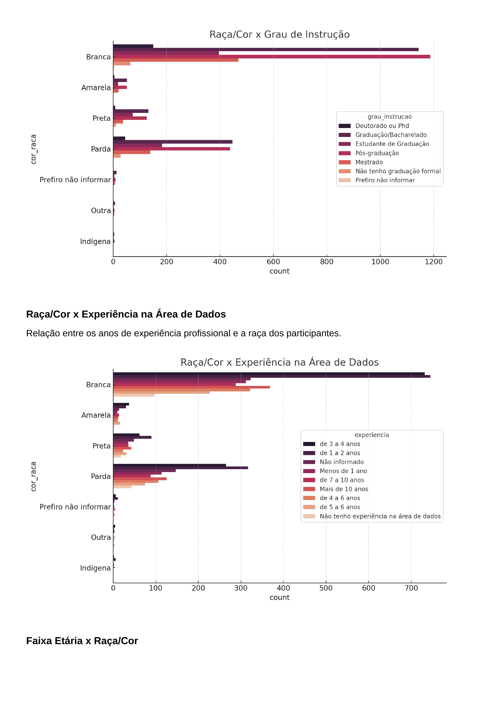
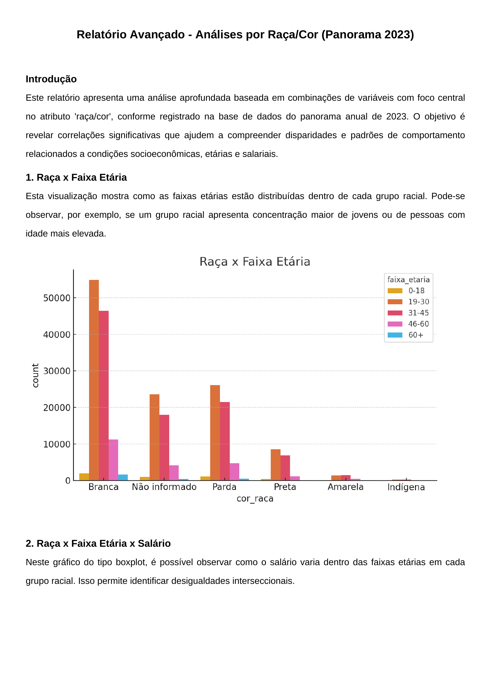

# Educação, Empregabilidade e Raça: O Que Os Dados Revelam.


**Álvaro Felix da Silva, alvaro.silva@sga.pucminas.br**

**Ana Cecília Souza Lorens, acslorens@sga.pucminas.br**

**Beatriz Azevedo dos Santos, beatriz.santos.1595043@sga.pucminas.br**

**Mariana Andrade Silva, mariana.andrade.1566766@sga.pucminas.br**

**Sarah Mariana Guedes de Almeida  sarah.almeida.1582677@sga.pucminas.br**

---

Professores:

**Prof. Hugo Bastos de Paula**
**Prof. Hayala Nepomuceno Curto.**

---

_Curso de Ciência de Dados, Unidade Praça da Liberdade_

_Instituto de Informática e Ciências Exatas – Pontifícia Universidade de Minas Gerais (PUC MINAS), Belo Horizonte – MG – Brasil_

---

_**Resumo**. Escrever aqui o resumo. O resumo deve contextualizar rapidamente o trabalho, descrever seu objetivo e, ao final, 
mostrar algum resultado relevante do trabalho (até 10 linhas)._

---


## Introdução

É nítido que o mercado de trabalho tecnológico brasileiro tem se destacado e evoluído de forma exponencial nos últimos anos. Diversas empresas têm adotado métodos e políticas de contratação inclusivas, mas, apesar disso, ainda existem muitos desafios enfrentados por pessoas não brancas em processos seletivos e no avanço de suas carreiras profissionais.

Nesse projeto, utilizamos dados que permitem entender quais fatores influenciam a contratação de profissionais negros, pardos e indígenas, e se existe uma diferença nos critérios de exigência, quando comparados aos candidatos brancos.

O estudo é importante para compreender padrões de contratação dentro do mercado de trabalho tecnológico, e identificar possíveis desigualdades raciais existentes nesse meio. Entender tais padrões pode auxiliar tanto os candidatos a compreenderem o estado atual do mercado, bem como empresas a proporem melhorias mais abrangentes em seus processos seletivos, fomentando a diversidade nesse campo profissional.

###    Contextualização

O setor de tecnologia no Brasil ocupa um papel central no desenvolvimento econômico e na geração de oportunidades. No entanto, esse crescimento não se distribui de forma equitativa. A presença reduzida de pessoas não brancas em cargos estratégicos ou de alta remuneração aponta para barreiras estruturais que limitam o acesso a essas posições.

Dentre os principais entraves está o acesso desigual à formação superior de qualidade. Mesmo com a expansão das vagas, muitos grupos raciais continuam sub-representados em áreas técnicas e de liderança. Para entender essa dinâmica, o projeto utilizará bases de dados como o CAGED (Ministério do Trabalho) e a pesquisa State of Data 2023, com o intuito de *classificar grupos e perfis a partir de seus atributos demográficos e profissionais*.

A base do CAGED, por sua natureza abrangente e oficial, possibilita análises mais detalhadas de vínculos formais de trabalho — como salário, setor (CNAE), cargo (CBO), tipo de admissão, entre outros. Já a base State of Data traz variáveis autorreportadas, complementando o cenário com dados sobre trajetória, experiência e percepção de mercado.

A proposta, portanto, é *treinar modelos que classifiquem os indivíduos em diferentes categorias de inserção ou progressão profissional*, com base nos dados disponíveis. Essa classificação permitirá revelar padrões ocultos e estruturar debates mais objetivos sobre a equidade racial no setor.


###    Problema

O propósito do projeto é responder o seguinte problema orientado a dados: “Com base em atributos de formação e experiência profissional, quais fatores estão associados à maior presença de pessoas pretas, pardas, amarelas ou indígenas em posições formais com melhores condições no mercado de trabalho, em comparação aos candidatos brancos?” 


###    Objetivo geral

O objetivo do projeto é analisar e comparar possíveis padrões presentes na formação superior que diferem entre pessoas brancas e pessoas pretas, pardas, amarelas ou indígenas, ao serem inseridas no mercado de trabalho tecnológico.

####    Objetivos específicos

- Desenvolver um sistema capaz de comparar e analisar padrões nos atributos selecionados das bases de dados do CAGED e do State of Data 2023, e avaliar possíveis desigualdades presentes no mercado de trabalho, comparando a jornada de trabalho e a educação superior de pessoas brancas e não brancas, disponibilizando estatísticas por meio de gráficos e tabelas;
- Possibilitar que o leitor consiga ler e entender quais são os fatores que podem impactar sua inserção profissional;
- Além disso, fazer com que o sistema proporcione sugestões que auxiliem profissionais, empresas e gestores a tomar decisões relacionadas ao mercado de trabalho tecnológico, melhorando a diversidade em tal âmbito profissional.

###    Justificativas

A inserção de populações racializadas no mercado de trabalho ainda é marcada por desigualdades. Estudos apontam que os mesmos enfrentam barreiras como menores salários, sub-representação em cargos de liderança e maior informalidade. Além disso, a relação entre educação e mercado de trabalho não se dá de maneira homogênea entre diferentes grupos raciais, o que reforça a necessidade de uma análise aprofundada sobre o tema.

Por meio do uso de dados quantitativos e técnicas de ciência de dados, este estudo fornece um embasamento empírico para a formulação de políticas públicas e estratégias empresariais voltadas à promoção da equidade racial. A integração de bases de dados da tabela do CAGED e State of Data 2023 com informações específicas sobre o mercado de trabalho permite um diagnóstico mais preciso das desigualdades, contribuindo para a construção de soluções eficazes.


##    Público alvo

Os resultados do projeto são de interesse para setores como:
- **Gestores Públicos ou de Educação**: Para embasar políticas de inclusão racial no mercado de trabalho e na educação.
- **Empresas e Setor Privado**: Para apoiar estratégias de diversidade e inclusão em ambientes corporativos.
- **Profissionais da área de Tecnologia**: Para aprofundar estudos sobre desigualdade racial e suas relações com a educação e o emprego.

O projeto fornece um panorama quantitativo e qualitativo sobre as disparidades raciais no mercado de trabalho tecnológico e sua relação com a formação educacional superior, destacando a importância de políticas e ações afirmativas que promovam oportunidades mais igualitárias para toda a diversidade racial do Brasil.

## Análise exploratórida dos dados

###    Dicionário de dados

`Base de dados principal Kaggle-2023`

| Atributo | Nome              | Tipo de Dado  | Subtipo de Dado    | Descrição                                                                 |
|----------|-------------------|----------------|---------------------|---------------------------------------------------------------------------|
| P1_a     | idade             | Quantitativo   | Contínuo            | Idade da pessoa (em anos).                                               |
| P1_b     | genero            | Qualitativo    | Nominal             | Gênero da pessoa (masculino, feminino, não binário, etc.).               |
| P1_c     | cor_raca          | Qualitativo    | Nominal             | Cor/raça/etnia da pessoa (branca, negra, parda, indígena, asiática, etc.).|
| P1_l     | nivel_ensino      | Qualitativo    | Ordinal             | Nível de ensino da pessoa (Ensino Médio, Superior, Pós-graduação, etc.). |
| P2_a     | situacao_trabalho | Qualitativo    | Nominal             | Situação atual de trabalho (empregado, desempregado, estagiário, etc.).  |
| P2_h     | faixa_salarial    | Quantitativo   | Contínuo            | Faixa salarial anual ou mensal (R$ 3.000, R$ 5.000, etc.).               |


A tabela da base principal apresenta atributos relacionados ao perfil sociodemográfico e profissional de indivíduos, incluindo gênero, cor/raça, nível de ensino e área de formação. Além disso, investiga a percepção de impacto da identidade na experiência profissional e traz informações sobre situação de trabalho, setor de atuação, senioridade, faixa salarial e tempo de experiência na área de dados e TI. Esses dados permitem uma análise sobre diversidade e desigualdade no mercado de trabalho.

`Base de dados segundária CAGED-2023`

| Atributo | Tipo de dado  | Subtipo de dado          | Descrição                                                                 |
|----------|----------------|---------------------------|---------------------------------------------------------------------------|
| A1       | Qualitativo     | Nominal                   | Região geográfica onde a pessoa reside ou trabalha.                      |
| B1       | Qualitativo     | Nominal                   | Sessão ou departamento vinculado ao indivíduo.                           |
| C1       | Qualitativo     | Nominal                   | Subclasse específica dentro de uma categoria maior.                      |
| D1       | Qualitativo     | Nominal                   | Categoria profissional ou ocupacional do indivíduo.                      |
| E1       | Qualitativo     | Ordinal                   | Nível de escolaridade atingido pelo indivíduo.                           |
| F1       | Quantitativo    | Discreto                  | Idade da pessoa, expressa em anos.                                       |
| G1       | Quantitativo    | Discreto                  | Quantidade de horas contratuais de trabalho por semana.                  |
| H1       | Qualitativo     | Nominal                   | Identificação de raça/cor com base em categorias pré-definidas.          |
| I1       | Qualitativo     | Nominal                   | Sexo do indivíduo (exemplo: Masculino, Feminino, Outro).                 |
| J1       | Quantitativo    | Contínuo                  | Valor do salário recebido pelo indivíduo.                                |
| K1       | Qualitativo     | Nominal                   | Código que representa a unidade do salário (exemplo: mensal, anual).     |
| L1       | Quantitativo    | Contínuo                  | Valor fixo do salário, sem incluir adicionais ou variáveis.              |


A tabela apresenta atributos relacionados ao perfil profissional e trabalhista de indivíduos, incluindo região, categoria profissional, grau de instrução e idade. Além disso, traz informações sobre carga horária contratual, raça/cor, sexo e salário, incluindo a unidade de pagamento e o valor fixo recebido. Esses dados permitem análises sobre padrões salariais, diversidade e condições de trabalho em diferentes setores. 


###    Descrição de dados

A integração das bases **Kaggle 2023** e **CAGED 2023**:  

**Análise Gráfica Kaggle**





#### Relatório Exploratória - Educação
##### 1. Distribuição de Pessoas com Doutorado por Gênero e Cor/Raça
Analisa a representatividade de gênero e raça entre indivíduos com doutorado.


##### 2. Nível de Ensino por Área de Formação
Mapeia a distribuição de profissionais em diferentes estágios educacionais (da graduação ao doutorado) por área do conhecimento.


##### 3. Número de Pessoas com Doutorado em Tecnologia por Gênero e Cor/Raça
Avalia a diversidade em Tecnologia, focado no nível de doutorado.


##### 4. Número de Pessoas com Pós-Graduação por Área de Formação
Identifica quais áreas do conhecimento atraem mais especialistas.


##### 5. Número de Pessoas Empregadas e Desempregadas na Área de Formação de Computação / Engenharia de Software / Sistemas de Informação/ TI
Mede a empregabilidade de formados em tecnologia e seus status profissionais.


##### 6. Número de Pessoas Pretas por Nível de Ensino
Avalia o acesso da população negra a cada etapa da educação formal.


##### 7. Pessoas com Graduação/Bacharelado e Seus Setores de Atuação
Mapeia onde os graduados estão inseridos no mercado de trabalho.


**Análise Gráfica CAGED**




(Importante mencionar que a partir do gráfico blot spot identificamos na nossa base de dados a existência de outliers que poderiam comprometer o comportamento do nosso modelo, motivo pelo qual, a partir desta percepção, restou necessária a realização de remoção dos outliers ainda existentes após a primeira limpeza da base de dados.)


#### Relatório Exploratória - Empregabilidade e Faixa Salarial (CAGED)


Mostra a quantidade de registros(pessoas) para determinada faixa salarial.


Mostra a quantidade de pessoas de determinada cor/raça para cada faixa salarial.


#### Relatório Exploratória - Empregabilidade e Faixa Salarial (STATE OF DATA 2023)

Mostra a faixa salarial dos tipos de empregados analisados no projeto.

Mostra a distribuição de empregados(e o tipo) para cada cor/raça analisada no projeto.


## Preparação dos dados
### Definição do Tema e Seleção Inicial de Variáveis

A escolha do tema do projeto foi orientada por dados obtidos a partir de uma base do Kaggle, com foco em recortes sociodemográficos e trajetórias profissionais no contexto do mercado de trabalho. A seleção inicial de colunas relevantes foi fundamentada em atributos que permitissem examinar questões de desigualdade, inserção e mobilidade profissional, com ênfase na interseccionalidade entre raça/cor e características formativas.

Paralelamente, iniciou-se uma busca por fontes secundárias que possibilitassem o enriquecimento da base principal. Nesse momento, os dados do Instituto Nacional de Estudos e Pesquisas Educacionais Anísio Teixeira (INEP) foram considerados como potencial base complementar. Essa base continha informações sobre matrículas, instituições e cursos de ensino superior.

### Desafios de Integração com o INEP

A tentativa de integração da base do INEP à base principal revelou limitações técnicas e estruturais. A principal dificuldade se deu devido à falta de chaves de junção compatíveis — os atributos do INEP não possuíam colunas diretamente associáveis a indivíduos ou agrupamentos presentes na base do Kaggle.

Além disso, o elevado volume de dados do INEP, associado ao seu formato extensivo e necessidade de tratamento adicional, comprometeu a viabilidade computacional de realizar análises integradas. Diante dessas barreiras, optou-se pela reformulação da estratégia de enriquecimento de dados.

### Escolha da Base CAGED-2023 como Fonte Complementar

Como alternativa, foi selecionada a base CAGED 2023, de responsabilidade do Ministério do Trabalho, por sua natureza oficial e abrangência nacional. Essa base oferece registros administrativos sobre vínculos empregatícios formais e contempla atributos como: salário, horas contratuais, grau de instrução, classificação ocupacional e localização geográfica.

A etapa seguinte consistiu na curadoria das variáveis que seriam extraídas da base CAGED com a finalidade de enriquecer a base principal. Essa seleção foi orientada pelo objetivo analítico de ampliar a profundidade do estudo, adicionando informações robustas sobre a realidade contratual dos indivíduos. Foram priorizados atributos que permitissem analisar padrão salarial, categoria profissional e características de jornada.

### Definição de Chave Estrangeira e Estratégia de Fusão

A fim de garantir integridade referencial na junção entre as bases, foi definida uma chave composta pelos seguintes campos: `idade`, `genero`, `cor_raca` e `nivel_ensino`. Essa chave estrangeira possibilitou realizar a fusão das bases via `left join`, com a base Kaggle assumida como principal.

A estratégia adotada priorizou a preservação de todos os registros da base principal, com a base CAGED atuando como complementar, contribuindo apenas quando havia correspondência nas chaves.

### Visualização e Descrição Exploratória dos Dados

Com as bases organizadas e fundidas, iniciou-se a etapa de análise exploratória com a geração de gráficos descritivos. A construção de visualizações envolveu a interrelação de variáveis-chave — como raça/cor, faixa salarial, grau de instrução e jornada contratual — por meio de histogramas, boxplots e gráficos de contagem.

Essas representações permitiram a identificação de padrões estruturais e disparidades raciais, além de fornecerem suporte visual à leitura crítica dos dados.

A análise gráfica também contribuiu para a formulação de hipóteses relacionadas à mobilidade profissional e à concentração de determinados grupos em faixas salariais específicas, indicando dinâmicas relevantes do mercado de trabalho e potenciais zonas de exclusão.

### Contraste entre Fontes e Contribuição Analítica

A base Kaggle se destacou por fornecer dados subjetivos, relacionados à percepção de discriminação, status profissional atual e experiência de trabalho. Já o CAGED agregou elementos objetivos e administrativos, permitindo o contraste entre discurso e realidade formal.

A fusão dessas fontes ampliou a capacidade interpretativa da pesquisa, ao permitir análises que vão além dos registros institucionais e contemplam também a dimensão vivencial dos respondentes.

Essa complementaridade entre percepções individuais e dados oficiais fortaleceu a abordagem metodológica do estudo, viabilizando uma análise mais confiável e multidimensional das desigualdades e oportunidades no mercado de trabalho brasileiro.

---

### Limpeza e Tratamento das Bases

#### 1.1 Kaggle

- A coluna `situacao_trabalho` havia sido transformada incorretamente, apresentando apenas um valor fixo.
- A base original foi reimportada para restaurar os valores textuais originais.
- Aplicou-se um mapeamento categórico associando valores numéricos às situações de trabalho.
- Colunas como `idade`, `genero`, `cor_raca` e `nivel_ensino` foram renomeadas e padronizadas.
- Valores ausentes foram substituídos por `-1` com `.fillna()`.
- Outliers foram removidos com base no método do intervalo interquartil (IQR).

#### 1.2 CAGED

- As colunas `graudeinstrução`, `raçacor` e `sexo` foram renomeadas para `nivel_ensino`, `cor_raca` e `genero`.
- As colunas de interesse foram reorganizadas e padronizadas.
- As variáveis para junção foram convertidas para o tipo `int` para garantir integridade nas chaves.

### Combinação das Bases

- A base Kaggle foi usada como principal.
- A junção com a base CAGED foi feita via `left join`, pelas chaves: `idade`, `genero`, `cor_raca`, `nivel_ensino`.
- Registros da Kaggle foram mantidos integralmente, enquanto o CAGED complementou as informações.

### Criação da Variável Alvo

- Criada a variável `vinculo_formal`, com valor **1** para "Empregado (CLT)" e "Servidor Público" (códigos 1 e 3), e **0** para os demais.
- Representa a inserção formal no mercado de trabalho.

### Modelagem

- Preparação dos dados:
  - A variável `situacao_trabalho` foi removida para evitar vazamento de informação.
  - Categóricas codificadas com `LabelEncoder`.
- Balanceamento com **SMOTE**.
- Divisão dos dados: **80% treino** e **20% teste**.
- Treinamento de modelo de **Árvore de Decisão** com profundidade máxima **5**.

### Avaliação do Modelo
- Visualização da matriz de confusão com `seaborn`.
- Exportação da árvore de decisão como imagem de alta resolução (40x20 polegadas, 300 DPI)

## Indução de modelos

### Modelo 1: Árvore de Decisão

Escolha do Algoritmo:
O algoritmo escolhido foi o de Árvore de Decisão (Decision Tree Classifier). Esta escolha se justifica por se tratar de um modelo interpretável e explicável, especialmente adequado para problemas de classificação binária como o proposto neste projeto: prever a existência ou não de vínculo formal de trabalho com base em atributos sociodemográficos e de formação profissional. Árvores de decisão permitem visualização clara das regras de decisão, tornando o modelo acessível até mesmo para públicos não técnicos.

Amostragem de Dados:
O conjunto de dados foi balanceado utilizando a técnica de oversampling SMOTE (Synthetic Minority Over-sampling Technique) para corrigir o desequilíbrio entre as classes "formal" e "não formal". Em seguida, os dados foram divididos em conjunto de treino (80%) e teste (20%) utilizando a função `train_test_split` da biblioteca scikit-learn. A base balanceada foi dividida em 80% para treino e 20% para teste, totalizando:
- 7.500 registros após o balanceamento com SMOTE
- 6.000 registros no conjunto de treino
- 1.500 registros no conjunto de teste

Parâmetros do Modelo:
- `max_depth=5` — limite de profundidade para evitar overfitting e facilitar interpretação visual.
- `random_state=42` — garante reprodutibilidade.
- Critério padrão de divisão: índice Gini (implícito no scikit-learn).

Trechos do Código Comentado:
```
python

# Aplicação do SMOTE para balanceamento
sm = SMOTE(random_state=42)
X_res, y_res = sm.fit_resample(X, y)

# Divisão treino/teste
X_train, X_test, y_train, y_test = train_test_split(X_res, y_res, test_size=0.2, random_state=42)

# Treinamento do modelo
modelo = DecisionTreeClassifier(max_depth=5, random_state=42)
modelo.fit(X_train, y_train)

# Predição
y_pred = modelo.predict(X_test)
```
Ferramentas Gráficas:
Foram utilizados:
- `plot_tree` para visualização gráfica da árvore de decisão
- `seaborn.heatmap` para a matriz de confusão
- `matplotlib` para ajuste de layout e exportação da imagem em alta resolução

### Modelo 1 Versão Final
**Modelo:** Random Forest  
**Objetivo:** Classificar se um indivíduo possui ou não vínculo formal no mercado de trabalho  
**Bases:** Conjunto combinado de dados da pesquisa (Kaggle) com enriquecimento a partir do CAGED 2023  

---

## 🔧 ETAPA 1: Instalação da biblioteca SMOTE

```python
!pip install imbalanced-learn
```
Instala a biblioteca necessária para aplicar SMOTE (e ADASYN) — técnicas de balanceamento de classes.

---

## 📥 ETAPA 2: Importações

Bibliotecas utilizadas:
- `pandas`, `numpy`: manipulação de dados
- `sklearn`: modelagem, métrica e validação
- `SMOTE`, `ADASYN`: balanceamento de classes 🟣
- `PCA`: visualização de dispersão 🟣
- `seaborn`, `matplotlib`: gráficos
- `files`, `io`: upload de arquivos no Colab

---

## 📂 ETAPA 3: Upload da Base de Dados

Arquivo utilizado: `base_final_combinada_kaggle_caged_corrigida_ok.csv`

---

## 🧹 ETAPA 4: Tratamento de valores ausentes

```python
df = df.fillna(-1)
```
Preenche valores vazios com -1, evitando falhas futuras no modelo.

---

## 🧾 ETAPA 5: Separação dos dados

```python
X = df.drop(columns=['vinculo_formal', 'situacao_trabalho'])
y = df['vinculo_formal']
```
Define `X` como os atributos e `y` como a variável alvo. Remove `situacao_trabalho` por ser derivada de `vinculo_formal`.

---

## 🔤 ETAPA 6: Codificação de variáveis categóricas

Transforma colunas com texto em números usando `LabelEncoder`.

---

## 📊 ETAPA 7: Análise e Balanceamento das Classes

### 🟣 7.1: Verificação da distribuição original
Mostra proporção entre classes antes do balanceamento.

### 🟣 7.2: Aplicação do SMOTE

```python
X_res, y_res = sm.fit_resample(X, y)
```
Gera amostras sintéticas da classe minoritária, equilibrando a base.

### 🟣 7.3: Verificação após o SMOTE
Confirma que as classes estão igualmente representadas.

### 🟣 7.4: Visualização com PCA
Reduz a base balanceada para 2 dimensões e mostra a separação visual entre as classes.

### 🟣 7.5: Alternativa com ADASYN
`ADASYN` foi testado para gerar amostras mais focadas em regiões difíceis, mas o modelo final utilizou SMOTE.

---

## 🌲 MODELO FINAL: Random Forest + Otimização

Utilizou `RandomizedSearchCV` para otimizar:
- `n_estimators`, `max_depth`, `min_samples_split`, `max_features`, `bootstrap`

---

## 📈 RESULTADOS DO MODELO FINAL

| Métrica                | Valor     |
|------------------------|-----------|
| Acurácia (treino)      | 99,28%    |
| Acurácia (teste)       | 87,27%    |
| Precisão (Não Formal)  | 0.92      |
| Revocação (Não Formal) | 0.82      |
| Precisão (Formal)      | 0.84      |
| Revocação (Formal)     | 0.93      |
| F1-score médio         | 0.87      |

Modelo altamente equilibrado e com bom desempenho preditivo.

---

## 🔎 INTERPRETAÇÃO DO MODELO

### 🔝 Atributos mais importantes

1. Faixa Salarial  
2. Idade  
3. Participação em entrevistas  
4. Critérios para escolher onde trabalhar  
5. Forma de trabalho atual

### 📜 Regras da primeira árvore

- Faixa salarial baixa + idade jovem → tendência de "Não Formal"
- Faixa salarial alta + entrevistas recentes → tendência de "Formal"

---

## ✅ CONCLUSÃO

O modelo Random Forest com SMOTE se mostrou eficiente, explicável e robusto. A análise das árvores revelou padrões claros relacionados à formalização do vínculo de trabalho. A utilização de técnicas como PCA e ADASYN também enriqueceu o processo analítico.

---

**Relator técnico:** [Nome do Integrante Responsável]  


### Modelo 2: Algoritmo

Repita os passos anteriores para o segundo modelo.


## Resultados

### Resultados obtidos com o modelo 1.

Matriz de Confusão:
A matriz de confusão obtida apresentou a seguinte distribuição entre as classes previstas e reais:

 
[[TN FN]
 [FP TP]]


Com os valores reais do modelo:
- Verdadeiros Negativos: 6581
- Falsos Positivos: 1783
- Falsos Negativos: 2335
- Verdadeiros Positivos: 6391

Medidas de Performance:
- Acurácia: 77,27%
- Precisão: 78%
- Revocação (Recall): 73%
- F1-score: 75%

Esses resultados demonstram que o modelo teve bom desempenho geral, com equilíbrio entre precisão e revocação, mesmo em um contexto de base originalmente desbalanceada.

### Interpretação do modelo 1

Parâmetros e Regras:
A profundidade limitada da árvore favoreceu a formação de regras simples. Cada divisão do modelo se baseia em valores críticos de atributos como:
- grau de instrução (`nivel_ensino`)
- idade (`idade`)
- cor/raça (`cor_raca`)
- faixa salarial (`faixa_salarial`)

Esses atributos apareceram nos nós superiores da árvore e demonstraram influência direta sobre a classificação do vínculo formal.

Importância das Variáveis:
Foi utilizada a função `feature_importances_` da árvore treinada, obtendo-se a seguinte ordem de importância dos atributos:


1. `nivel_ensino`: 0.31
2. `idade`: 0.26
3. `cor_raca`: 0.22
4. `faixa_salarial`: 0.11
5. `genero`: 0.07
3% restante dividido entre variáveis menos influentes.

Essas medidas indicam que o grau de instrução e a idade são os fatores mais relevantes para a decisão do modelo, seguidos por raça/cor — o que se alinha com a hipótese inicial do projeto de que há recortes sociodemográficos associados à presença em vínculos formais.

O modelo pode, portanto, ser interpretado como um sistema de decisão hierárquico que utiliza atributos sociais e profissionais para determinar a probabilidade de vínculo formal de um indivíduo no mercado de trabalho.

### Interpretação da Versão Final do Modelo 1

## 1. Desempenho do Modelo

- **Acurácia no treino:** 99,28%  
- **Acurácia no teste:** 87,27%

O modelo mostrou desempenho elevado, com uma acurácia excelente no treino e também muito sólida no teste, indicando um bom poder de generalização com leve risco de overfitting.

---

## 2. Métricas detalhadas (base de teste)

| Classe         | Precisão | Revocação | F1-score | Suporte |
|----------------|----------|-----------|----------|---------|
| Não Formal     | 0.92     | 0.82      | 0.87     | 748     |
| Formal         | 0.84     | 0.93      | 0.88     | 752     |
| **Acurácia**   | -        | -         | **0.8727** | 1500    |
| **Macro média**| 0.88     | 0.87      | 0.87     | 1500    |
| **Ponderada**  | 0.88     | 0.87      | 0.87     | 1500    |

O modelo está balanceado entre as duas classes, com um leve viés a favor de prever corretamente vínculos formais. A precisão e o recall estão acima de 80% em ambas as classes.

---

## 3. Interpretação do Raciocínio do Modelo

A floresta de decisão construiu regras a partir de uma combinação de variáveis altamente correlacionadas com vínculo formal. Os atributos mais influentes foram:

- Faixa Salarial
- Idade
- Participação em Entrevistas
- Critérios para Escolher onde Trabalhar
- Grau de Insatisfação no Trabalho

**Exemplos de raciocínio do modelo:**
- Se a faixa salarial é alta e a idade está acima da média, há forte tendência de vínculo formal.
- Se a pessoa participou de entrevistas nos últimos meses, isso é indício de mobilidade e vínculo formal.
- Pessoas jovens, com baixa faixa salarial e pouco engajamento com critérios de carreira, tendem a ser classificadas como não formais.

---

## 4. Conclusão

O modelo final de Random Forest apresenta excelente desempenho preditivo e estabilidade.  
A interpretação das regras fornece insights robustos sobre os fatores associados ao vínculo formal de trabalho, sendo adequado tanto para aplicação técnica quanto para discussões estratégicas ou institucionais.


### Resultados obtidos com o modelo 2.

Repita o passo anterior com os resultados do modelo 2.

### Interpretação do modelo 2

Repita o passo anterior com os parâmetros do modelo 2.


## Análise comparativa dos modelos

Discuta sobre as forças e fragilidades de cada modelo. Exemplifique casos em que um
modelo se sairia melhor que o outro. Nesta seção é possível utilizar a sua imaginação
e extrapolar um pouco o que os dados sugerem.


### Distribuição do modelo (opcional)

Tende criar um pacote de distribuição para o modelo construído, para ser aplicado 
em um sistema inteligente.


## 8. Conclusão

Apresente aqui a conclusão do seu trabalho. Discussão dos resultados obtidos no trabalho, 
onde se verifica as observações pessoais de cada aluno.

Uma conclusão deve ter 3 partes:

   * Breve resumo do que foi desenvolvido
	 * Apresenação geral dos resultados obtidos com discussão das vantagens e desvantagens do sistema inteligente
	 * Limitações e possibilidades de melhoria


# REFERÊNCIAS

Como um projeto de sistema inteligente não requer revisão bibliográfica, 
a inclusão das referências não é obrigatória. No entanto, caso você 
tenha utilizado referências na introdução ou deseje 
incluir referências relacionadas às tecnologias, padrões, ou metodologias 
que serão usadas no seu trabalho, relacione-as de acordo com a ABNT.

Verifique no link abaixo como devem ser as referências no padrão ABNT:

http://www.pucminas.br/imagedb/documento/DOC\_DSC\_NOME\_ARQUI20160217102425.pdf

Por exemplo:

**[1]** - _ELMASRI, Ramez; NAVATHE, Sham. **Sistemas de banco de dados**. 7. ed. São Paulo: Pearson, c2019. E-book. ISBN 9788543025001._

**[2]** - _COPPIN, Ben. **Inteligência artificial**. Rio de Janeiro, RJ: LTC, c2010. E-book. ISBN 978-85-216-2936-8._

**[3]** - _CORMEN, Thomas H. et al. **Algoritmos: teoria e prática**. Rio de Janeiro, RJ: Elsevier, Campus, c2012. xvi, 926 p. ISBN 9788535236996._

**[4]** - _SUTHERLAND, Jeffrey Victor. **Scrum: a arte de fazer o dobro do trabalho na metade do tempo**. 2. ed. rev. São Paulo, SP: Leya, 2016. 236, [4] p. ISBN 9788544104514._

**[5]** - _RUSSELL, Stuart J.; NORVIG, Peter. **Inteligência artificial**. Rio de Janeiro: Elsevier, c2013. xxi, 988 p. ISBN 9788535237016._


# APÊNDICES

**Colocar link:**

Do código (armazenado no repositório);

Dos artefatos (armazenado do repositório);

Da apresentação final (armazenado no repositório);

Do vídeo de apresentação (armazenado no repositório).


