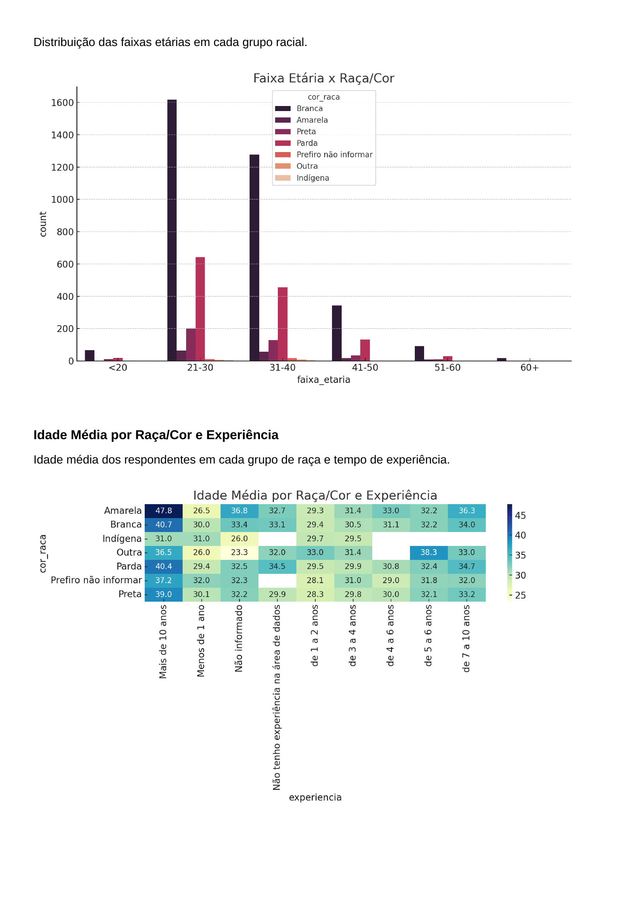
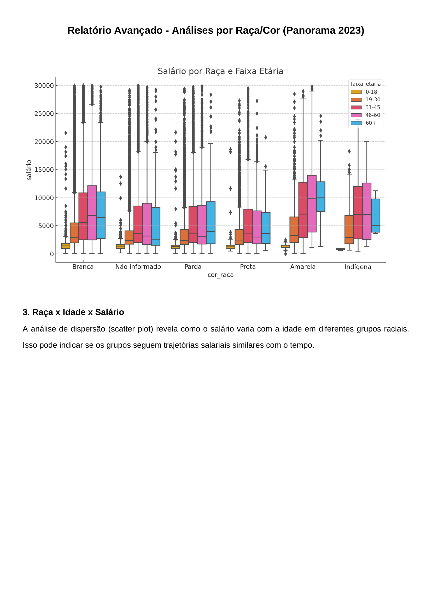

# Educação, Empregabilidade e Raça: O Que Os Dados Revelam.

**Álvaro Felix da Silva, alvaro.silva@sga.pucminas.br**

**Ana Cecília Souza Lorens, acslorens@sga.pucminas.br**

**Beatriz Azevedo dos Santos, beatriz.santos.1595043@sga.pucminas.br**

**Mariana Andrade Silva, mariana.andrade.1566766@sga.pucminas.br**

**Sarah Mariana Guedes de Almeida  sarah.almeida.1582677@sga.pucminas.br**

---

Professores:

**Prof. Hugo Bastos de Paula**
**Prof. Hayala Nepomuceno Curto.**

---

_Curso de Ciência de Dados, Unidade Praça da Liberdade_

_Instituto de Informática e Ciências Exatas – Pontifícia Universidade de Minas Gerais (PUC MINAS), Belo Horizonte – MG – Brasil_

---

_**Resumo**. Escrever aqui o resumo. O resumo deve contextualizar rapidamente o trabalho, descrever seu objetivo e, ao final, 
mostrar algum resultado relevante do trabalho (até 10 linhas)._

---

## Introdução

É nítido que o mercado de trabalho tecnológico brasileiro tem se destacado e evoluído de forma exponencial nos últimos anos. Diversas empresas têm adotado métodos e políticas de contratação inclusivas, mas, apesar disso, ainda existem muitos desafios enfrentados por pessoas não brancas em processos seletivos e no avanço de suas carreiras profissionais.

Nesse projeto, utilizamos dados que permitem entender quais fatores influenciam a contratação de profissionais negros, pardos e indígenas, e se existe uma diferença nos critérios de exigência, quando comparados aos candidatos brancos.

O estudo é importante para compreender padrões de contratação dentro do mercado de trabalho tecnológico, e identificar possíveis desigualdades raciais existentes nesse meio. Entender tais padrões pode auxiliar tanto os candidatos a compreenderem o estado atual do mercado, bem como empresas a proporem melhorias mais abrangentes em seus processos seletivos, fomentando a diversidade nesse campo profissional.

###    Contextualização

O setor de tecnologia no Brasil, em constante expansão, representa um fator crucial para o desenvolvimento econômico e social do país. No entanto, esse crescimento não se traduz em oportunidades equitativas para todos. As desigualdades raciais, profundamente enraizadas na história brasileira, persistem e se manifestam de forma alarmante nessa área.

Uma das principais barreiras enfrentadas está no acesso à educação superior de qualidade. Apesar da crescente demanda por profissionais qualificados, a baixa representação de pessoas pretas, pardas, amarelas e indígenas em cargos de liderança e em áreas de alta remuneração é evidente. Tal desigualdade não apenas limita o potencial individual, mas também restringe a capacidade de inovação e a diversidade de perspectivas no setor tecnológico.

Para compreender essa disparidade, este projeto utilizará bases de dados secundárias, como o CAGED, administrado pelo Ministério do Trabalho e Emprego. Diferente de bancos de dados baseados em respostas voluntárias, como os do Kaggle, o CAGED fornece informações oficiais e sistematicamente coletadas sobre contratações e demissões formais em todo o país. Sua abrangência nacional e atualização mensal permitem acompanhar as tendências do mercado de trabalho com maior precisão. Além disso, a base contém informações detalhadas sobre vínculos empregatícios, incluindo salário individual, setor de atuação (CNAE), cargo e ocupação (CBO), jornada de trabalho e tipo de admissão ou desligamento, o que possibilita análises mais granulares sobre desigualdade racial e remuneração.

Nesse contexto, este projeto se insere na interseção entre educação, raça e empregabilidade. Para isso, serão utilizadas bases de dados como as do CAGED e do State of Data 2023, que fornecem informações sobre a trajetória educacional e profissional de indivíduos no Brasil. A análise desses dados permitirá identificar padrões, contribuindo para a formulação de políticas e práticas que promovam a equidade racial no mercado de trabalho tecnológico.

###    Problema

O propósito do projeto é responder o seguinte problema orientado a dados: “Existem fatores na formação superior que impactam na inserção e progressão profissional de pessoas pretas, pardas, amarelas ou indígenas no mercado de trabalho tecnológico brasileiro?” 

###    Objetivo geral

O objetivo do projeto é analisar e comparar possíveis padrões presentes na formação superior que diferem entre pessoas brancas e pessoas pretas, pardas, amarelas ou indígenas, ao serem inseridas no mercado de trabalho tecnológico.

####    Objetivos específicos

- Desenvolver um sistema capaz de comparar e analisar padrões nos atributos selecionados das bases de dados do CAGED e do State of Data 2023, e avaliar possíveis desigualdades presentes no mercado de trabalho, comparando a jornada de trabalho e a educação superior de pessoas brancas e não brancas, disponibilizando estatísticas por meio de gráficos e tabelas;
- Possibilitar que o leitor consiga ler e entender quais são os fatores que podem impactar sua inserção profissional;
- Além disso, fazer com que o sistema proporcione sugestões que auxiliem profissionais, empresas e gestores a tomar decisões relacionadas ao mercado de trabalho tecnológico, melhorando a diversidade em tal âmbito profissional.

###    Justificativas

A inserção de populações racializadas no mercado de trabalho ainda é marcada por desigualdades. Estudos apontam que os mesmos enfrentam barreiras como menores salários, sub-representação em cargos de liderança e maior informalidade. Além disso, a relação entre educação e mercado de trabalho não se dá de maneira homogênea entre diferentes grupos raciais, o que reforça a necessidade de uma análise aprofundada sobre o tema.

Por meio do uso de dados quantitativos e técnicas de ciência de dados, este estudo fornece um embasamento empírico para a formulação de políticas públicas e estratégias empresariais voltadas à promoção da equidade racial. A integração de bases de dados da tabela do CAGED e State of Data 2023 com informações específicas sobre o mercado de trabalho permite um diagnóstico mais preciso das desigualdades, contribuindo para a construção de soluções eficazes.

##    Público alvo

Os resultados do projeto são de interesse para setores como:
- **Gestores Públicos ou de Educação**: Para embasar políticas de inclusão racial no mercado de trabalho e na educação.
- **Empresas e Setor Privado**: Para apoiar estratégias de diversidade e inclusão em ambientes corporativos.
- **Profissionais da área de Tecnologia**: Para aprofundar estudos sobre desigualdade racial e suas relações com a educação e o emprego.

O projeto fornece um panorama quantitativo e qualitativo sobre as disparidades raciais no mercado de trabalho tecnológico e sua relação com a formação educacional superior, destacando a importância de políticas e ações afirmativas que promovam oportunidades mais igualitárias para toda a diversidade racial do Brasil.

## Análise exploratórida dos dados

###    Dicionário de dados

`Base de dados principal Kaggle-2023`

| Atributo | Tipo de Dado  | Subtipo de Dado    | Descrição                                                                 |
|----------|----------------|---------------------|---------------------------------------------------------------------------|
| P1_b     | Qualitativo     | Nominal             | Gênero da pessoa (masculino, feminino, não binário, etc.).               |
| P1_c     | Qualitativo     | Nominal             | Cor/raça/etnia da pessoa (branca, negra, parda, indígena, asiática, etc.).|
| P1_e     | Qualitativo     | Binário (Booleano)  | Indica se a experiência profissional foi prejudicada (sim ou não).       |
| P1_e_2   | Qualitativo     | Binário (Booleano)  | Indica se a experiência foi prejudicada devido à cor/raça/etnia (sim ou não). |
| P1_f     | Qualitativo     | Nominal             | Aspectos prejudicados na experiência profissional (promoção, networking, etc.). |
| P1_l     | Qualitativo     | Ordinal             | Nível de ensino da pessoa (Ensino Médio, Superior, Pós-graduação, etc.). |
| P1_m     | Qualitativo     | Nominal             | Área de formação da pessoa (Ciências da Computação, Engenharia, etc.).   |
| P2_a     | Qualitativo     | Nominal             | Situação atual de trabalho (empregado, desempregado, estagiário, etc.).  |
| P2_b     | Qualitativo     | Nominal             | Setor da empresa ou área de atuação (Tecnologia, Saúde, Educação, etc.). |
| P2_g     | Qualitativo     | Ordinal             | Nível do cargo atual (Pleno, Júnior, Sênior, etc.).                       |
| P2_h     | Quantitativo    | Contínuo            | Faixa salarial anual ou mensal (R$ 3.000, R$ 5.000, etc.).               |
| P2_i     | Quantitativo    | Contínuo            | Tempo de experiência na área de dados (2 anos, 5 anos, etc.).            |
| P2_j     | Quantitativo    | Contínuo            | Tempo de experiência em TI antes de dados (3 anos, 6 anos, etc.).        |

A tabela da base principal apresenta atributos relacionados ao perfil sociodemográfico e profissional de indivíduos, incluindo gênero, cor/raça, nível de ensino e área de formação. Além disso, investiga a percepção de impacto da identidade na experiência profissional e traz informações sobre situação de trabalho, setor de atuação, senioridade, faixa salarial e tempo de experiência na área de dados e TI. Esses dados permitem uma análise sobre diversidade e desigualdade no mercado de trabalho.

`Base de dados segundária CAGED-2023`

| Atributo | Tipo de dado  | Subtipo de dado          | Descrição                                                                 |
|----------|----------------|---------------------------|---------------------------------------------------------------------------|
| A1       | Qualitativo     | Nominal                   | Região geográfica onde a pessoa reside ou trabalha.                      |
| B1       | Qualitativo     | Nominal                   | Sessão ou departamento vinculado ao indivíduo.                           |
| C1       | Qualitativo     | Nominal                   | Subclasse específica dentro de uma categoria maior.                      |
| D1       | Qualitativo     | Nominal                   | Categoria profissional ou ocupacional do indivíduo.                      |
| E1       | Qualitativo     | Ordinal                   | Nível de escolaridade atingido pelo indivíduo.                           |
| F1       | Quantitativo    | Discreto                  | Idade da pessoa, expressa em anos.                                       |
| G1       | Quantitativo    | Discreto                  | Quantidade de horas contratuais de trabalho por semana.                  |
| H1       | Qualitativo     | Nominal                   | Identificação de raça/cor com base em categorias pré-definidas.          |
| I1       | Qualitativo     | Nominal                   | Sexo do indivíduo (exemplo: Masculino, Feminino, Outro).                 |
| J1       | Quantitativo    | Contínuo                  | Valor do salário recebido pelo indivíduo.                                |
| K1       | Qualitativo     | Nominal                   | Código que representa a unidade do salário (exemplo: mensal, anual).     |
| L1       | Quantitativo    | Contínuo                  | Valor fixo do salário, sem incluir adicionais ou variáveis.              |

A tabela apresenta atributos relacionados ao perfil profissional e trabalhista de indivíduos, incluindo região, categoria profissional, grau de instrução e idade. Além disso, traz informações sobre carga horária contratual, raça/cor, sexo e salário, incluindo a unidade de pagamento e o valor fixo recebido. Esses dados permitem análises sobre padrões salariais, diversidade e condições de trabalho em diferentes setores. 

###    Descrição de dados

A integração das bases **Kaggle 2023** e **CAGED 2023**:  

**Análise Gráfica Kaggle**

#### Relatório Exploratória - Educação
##### 1. Distribuição de Pessoas com Doutorado por Gênero e Cor/Raça
Analisa a representatividade de gênero e raça entre indivíduos com doutorado.

##### 2. Nível de Ensino por Área de Formação
Mapeia a distribuição de profissionais em diferentes estágios educacionais (da graduação ao doutorado) por área do conhecimento.

##### 3. Número de Pessoas com Doutorado em Tecnologia por Gênero e Cor/Raça
Avalia a diversidade em Tecnologia, focado no nível de doutorado.

##### 4. Número de Pessoas com Pós-Graduação por Área de Formação
Identifica quais áreas do conhecimento atraem mais especialistas.

##### 5. Número de Pessoas Empregadas e Desempregadas na Área de Formação de Computação / Engenharia de Software / Sistemas de Informação/ TI
Mede a empregabilidade de formados em tecnologia e seus status profissionais.

##### 6. Número de Pessoas Pretas por Nível de Ensino
Avalia o acesso da população negra a cada etapa da educação formal.

##### 7. Pessoas com Graduação/Bacharelado e Seus Setores de Atuação
Mapeia onde os graduados estão inseridos no mercado de trabalho.

**Análise Gráfica CAGED**

#### Relatório Exploratória - Empregabilidade e Faixa Salarial (CAGED)

Mostra a quantidade de registros(pessoas) para determinada faixa salarial.

Mostra a quantidade de pessoas de determinada cor/raça para cada faixa salarial.

#### Relatório Exploratória - Empregabilidade e Faixa Salarial (STATE OF DATA 2023)

Mostra a faixa salarial dos tipos de empregados analisados no projeto.

Mostra a distribuição de empregados(e o tipo) para cada cor/raça analisada no projeto.

## Preparação dos dados
## Definição do Tema e Seleção Inicial de Variáveis

A escolha do tema do projeto foi orientada por dados obtidos a partir de uma base do Kaggle, com foco em recortes sociodemográficos e trajetórias profissionais no contexto do mercado de trabalho. A seleção inicial de colunas relevantes foi fundamentada em atributos que permitissem examinar questões de desigualdade, inserção e mobilidade profissional, com ênfase na interseccionalidade entre raça/cor e características formativas.

Paralelamente, iniciou-se uma busca por fontes secundárias que possibilitassem o enriquecimento da base principal. Nesse momento, os dados do Instituto Nacional de Estudos e Pesquisas Educacionais Anísio Teixeira (INEP) foram considerados como potencial base complementar. Essa base continha informações sobre matrículas, instituições e cursos de ensino superior.

## Desafios de Integração com o INEP

A tentativa de integração da base do INEP à base principal revelou limitações técnicas e estruturais. A principal dificuldade se deu devido à falta de chaves de junção compatíveis — os atributos do INEP não possuíam colunas diretamente associáveis a indivíduos ou agrupamentos presentes na base do Kaggle.

Além disso, o elevado volume de dados do INEP, associado ao seu formato extensivo e necessidade de tratamento adicional, comprometeu a viabilidade computacional de realizar análises integradas. Diante dessas barreiras, optou-se pela reformulação da estratégia de enriquecimento de dados.

## Escolha da Base CAGED-2023 como Fonte Complementar

Como alternativa, foi selecionada a base CAGED 2023, de responsabilidade do Ministério do Trabalho, por sua natureza oficial e abrangência nacional. Essa base oferece registros administrativos sobre vínculos empregatícios formais e contempla atributos como: salário, horas contratuais, grau de instrução, classificação ocupacional e localização geográfica.

A etapa seguinte consistiu na curadoria das variáveis que seriam extraídas da base CAGED com a finalidade de enriquecer a base principal. Essa seleção foi orientada pelo objetivo analítico de ampliar a profundidade do estudo, adicionando informações robustas sobre a realidade contratual dos indivíduos. Foram priorizados atributos que permitissem analisar padrão salarial, categoria profissional e características de jornada.

## Definição de Chave Estrangeira e Estratégia de Fusão

A fim de garantir integridade referencial na junção entre as bases, foi definida uma chave composta pelos seguintes campos: `idade`, `genero`, `cor_raca` e `nivel_ensino`. Essa chave estrangeira possibilitou realizar a fusão das bases via `left join`, com a base Kaggle assumida como principal.

A estratégia adotada priorizou a preservação de todos os registros da base principal, com a base CAGED atuando como complementar, contribuindo apenas quando havia correspondência nas chaves.

## Visualização e Descrição Exploratória dos Dados

Com as bases organizadas e fundidas, iniciou-se a etapa de análise exploratória com a geração de gráficos descritivos. A construção de visualizações envolveu a interrelação de variáveis-chave — como raça/cor, faixa salarial, grau de instrução e jornada contratual — por meio de histogramas, boxplots e gráficos de contagem.

Essas representações permitiram a identificação de padrões estruturais e disparidades raciais, além de fornecerem suporte visual à leitura crítica dos dados.

A análise gráfica também contribuiu para a formulação de hipóteses relacionadas à mobilidade profissional e à concentração de determinados grupos em faixas salariais específicas, indicando dinâmicas relevantes do mercado de trabalho e potenciais zonas de exclusão.

## Contraste entre Fontes e Contribuição Analítica

A base Kaggle se destacou por fornecer dados subjetivos, relacionados à percepção de discriminação, status profissional atual e experiência de trabalho. Já o CAGED agregou elementos objetivos e administrativos, permitindo o contraste entre discurso e realidade formal.

A fusão dessas fontes ampliou a capacidade interpretativa da pesquisa, ao permitir análises que vão além dos registros institucionais e contemplam também a dimensão vivencial dos respondentes.

Essa complementaridade entre percepções individuais e dados oficiais fortaleceu a abordagem metodológica do estudo, viabilizando uma análise mais confiável e multidimensional das desigualdades e oportunidades no mercado de trabalho brasileiro.

---

## Limpeza e Tratamento das Bases

### 1.1 Kaggle

- A coluna `situacao_trabalho` havia sido transformada incorretamente, apresentando apenas um valor fixo.
- A base original foi reimportada para restaurar os valores textuais originais.
- Aplicou-se um mapeamento categórico associando valores numéricos às situações de trabalho.
- Colunas como `idade`, `genero`, `cor_raca` e `nivel_ensino` foram renomeadas e padronizadas.
- Valores ausentes foram substituídos por `-1` com `.fillna()`.
- Outliers foram removidos com base no método do intervalo interquartil (IQR).

### 1.2 CAGED

- As colunas `graudeinstrução`, `raçacor` e `sexo` foram renomeadas para `nivel_ensino`, `cor_raca` e `genero`.
- As colunas de interesse foram reorganizadas e padronizadas.
- As variáveis para junção foram convertidas para o tipo `int` para garantir integridade nas chaves.

## Combinação das Bases

- A base Kaggle foi usada como principal.
- A junção com a base CAGED foi feita via `left join`, pelas chaves: `idade`, `genero`, `cor_raca`, `nivel_ensino`.
- Registros da Kaggle foram mantidos integralmente, enquanto o CAGED complementou as informações.

## Criação da Variável Alvo

- Criada a variável `vinculo_formal`, com valor **1** para "Empregado (CLT)" e "Servidor Público" (códigos 1 e 3), e **0** para os demais.
- Representa a inserção formal no mercado de trabalho.

## Modelagem

- Preparação dos dados:
  - A variável `situacao_trabalho` foi removida para evitar vazamento de informação.
  - Categóricas codificadas com `LabelEncoder`.
- Balanceamento com **SMOTE**.
- Divisão dos dados: **80% treino** e **20% teste**.
- Treinamento de modelo de **Árvore de Decisão** com profundidade máxima **5**.

## Avaliação do Modelo
- Visualização da matriz de confusão com `seaborn`.
- Exportação da árvore de decisão como imagem de alta resolução (40x20 polegadas, 300 DPI)

## Indução de modelos

### Modelo 1: Algoritmo

Substitua o título pelo nome do algoritmo que será utilizado. P. ex. árvore de decisão, rede neural, SVM, etc.
Justifique a escolha do modelo.
Apresente o processo utilizado para amostragem de dados (particionamento, cross-validation).
Descreva os parâmetros utilizados. 
Apresente trechos do código utilizado comentados. Se utilizou alguma ferramenta gráfica, apresente imagens
com o fluxo de processamento.

### Modelo 2: Algoritmo

Repita os passos anteriores para o segundo modelo.

## Resultados

### Resultados obtidos com o modelo 1.

Apresente aqui os resultados obtidos com a indução do modelo 1. 
Apresente uma matriz de confusão quando pertinente. Apresente as medidas de performance
apropriadas para o seu problema. 
Por exemplo, no caso de classificação: precisão, revocação, F-measure, acurácia.

### Interpretação do modelo 1

Apresente os parâmetros do modelo obtido. Tentre mostrar as regras que são utilizadas no
processo de 'raciocínio' (*reasoning*) do sistema inteligente. Utilize medidas como 
o *feature importances* para tentar entender quais atributos o modelo se baseia no
processo de tomada de decisão.

### Resultados obtidos com o modelo 2.

Repita o passo anterior com os resultados do modelo 2.

### Interpretação do modelo 2

Repita o passo anterior com os parâmetros do modelo 2.

## Análise comparativa dos modelos

Discuta sobre as forças e fragilidades de cada modelo. Exemplifique casos em que um
modelo se sairia melhor que o outro. Nesta seção é possível utilizar a sua imaginação
e extrapolar um pouco o que os dados sugerem.

### Distribuição do modelo (opcional)

Tende criar um pacote de distribuição para o modelo construído, para ser aplicado 
em um sistema inteligente.

## 8. Conclusão

Apresente aqui a conclusão do seu trabalho. Discussão dos resultados obtidos no trabalho, 
onde se verifica as observações pessoais de cada aluno.

Uma conclusão deve ter 3 partes:

   * Breve resumo do que foi desenvolvido
	 * Apresenação geral dos resultados obtidos com discussão das vantagens e desvantagens do sistema inteligente
	 * Limitações e possibilidades de melhoria

# REFERÊNCIAS

Como um projeto de sistema inteligente não requer revisão bibliográfica, 
a inclusão das referências não é obrigatória. No entanto, caso você 
tenha utilizado referências na introdução ou deseje 
incluir referências relacionadas às tecnologias, padrões, ou metodologias 
que serão usadas no seu trabalho, relacione-as de acordo com a ABNT.

Verifique no link abaixo como devem ser as referências no padrão ABNT:

http://www.pucminas.br/imagedb/documento/DOC\_DSC\_NOME\_ARQUI20160217102425.pdf

Por exemplo:

**[1]** - _ELMASRI, Ramez; NAVATHE, Sham. **Sistemas de banco de dados**. 7. ed. São Paulo: Pearson, c2019. E-book. ISBN 9788543025001._

**[2]** - _COPPIN, Ben. **Inteligência artificial**. Rio de Janeiro, RJ: LTC, c2010. E-book. ISBN 978-85-216-2936-8._

**[3]** - _CORMEN, Thomas H. et al. **Algoritmos: teoria e prática**. Rio de Janeiro, RJ: Elsevier, Campus, c2012. xvi, 926 p. ISBN 9788535236996._

**[4]** - _SUTHERLAND, Jeffrey Victor. **Scrum: a arte de fazer o dobro do trabalho na metade do tempo**. 2. ed. rev. São Paulo, SP: Leya, 2016. 236, [4] p. ISBN 9788544104514._

**[5]** - _RUSSELL, Stuart J.; NORVIG, Peter. **Inteligência artificial**. Rio de Janeiro: Elsevier, c2013. xxi, 988 p. ISBN 9788535237016._

# APÊNDICES

**Colocar link:**

Do código (armazenado no repositório);

Dos artefatos (armazenado do repositório);

Da apresentação final (armazenado no repositório);

Do vídeo de apresentação (armazenado no repositório).

